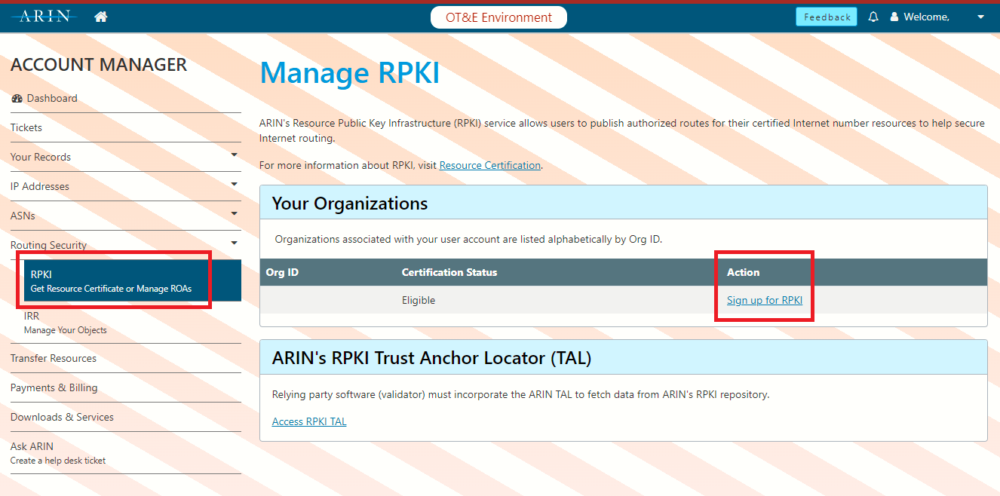
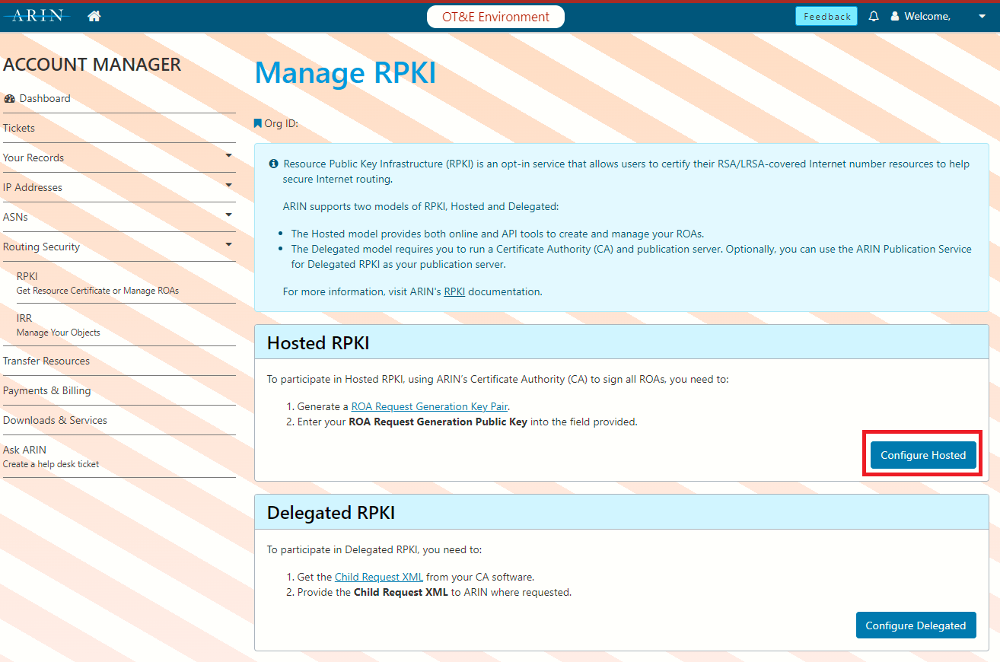
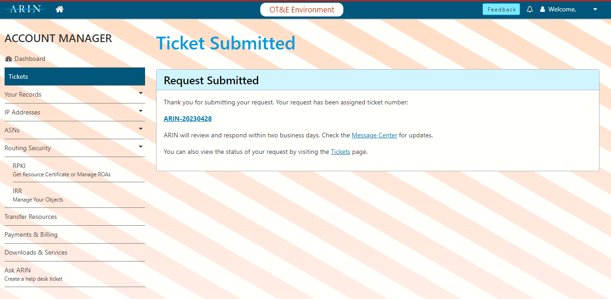

# RPKI — Resource Public Key Infrastructure

- RPKI uses cryptographically verifiable statements to ensure that Internet number resources are certifiably linked to the stated holders of those resources
- Each Regional Internet Registry (RIR) is responsible for providing resource certificates to resource holders (customer organizations)
- The resource certificate verifies the IP resources allocated to the organization
- Resource certificates are available only to organizations who have contractual relationships with one or more RIRs and have been allocated number resources (IP addresses)

**RPKI Terminology**

- **Resource Certificate**: A certificate issued by an RIR that lists a the Internet number resources (IPv4 addresses, IPv6 addresses, and Autonomous System Numbers) that are associated with an organization
- **Route Origin Authorization (ROA)**: A cryptographically signed object that states which Autonomous System (AS) is authorized to originate a particular IP address prefix or set of prefixes
    - ROA Name: a descriptive name for the ROA
	- Origin AS: the ASN that will originate the prefix
	- Start Date: the first date your ROA can be considered valid
	- End Date: the last date your ROA can be considered valid
	- Prefixes: a list of prefixes to be included in the ROA
- **Route Origin Validation**: Comparing route announcements to ROAs to determine whether a route announcement is valid
	- Valid: a ROA exists for the prefix, and the origin AS of the route announcement matches the origin AS specified in the ROA (the announcement should be accepted)
	- Invalid: a ROA exists for the prefix, but the origin AS of the announcement *does not* match the origin AS specified in the ROA (the announcement should be rejected)
	- Not Found: no ROA exists for the prefix in the announcement (the announcement is usually accepted)

## Viewing RPKI records
RPKI records are hosted in public repositories. The easiest way to query them is using a web service such as the [Cloudflare RPKI Portal](https://rpki.cloudflare.com/){:target="_blank"} or the [RIPE Routinator](https://rpki-validator.ripe.net/ui/){:target="_blank"}

**Example ROAs**

[206.82.16.0/20](https://rpki.cloudflare.com/?view=explorer&prefix=206.82.16.0%2F20&explorerTab=list){:target="_blank"}


A ROA exists for 206.82.16.0/20 to be announced by AS14773. The ROA is signed by the ARIN Trust Anchor because the IP prefix was assigned by ARIN.

## RPKI Models

- Hosted RPKI — Recommended
    - Each RIR hosts a Certificate Authority (CA) and signs Route Origin Authorizations (ROAs) for resources within the RIR region
	- Downstream organizations must have their upstream provider submit ROAs on their behalf
	- Infrastructure is maintained by the RIR
- Delegated RPKI
    - You can run your own RPKI Certification Authority (CA), manage your Route Origin Authorizations (ROAs) and publish them in your own repository
	- You can delegate subordinate CAs to downstream organization
	- Infrastructure is maintained by the organization

!!! info
    ROAs cannot be created by third parties! (unlike IRR proxy registration)

## Using the RPKI

### Publishing routing information (ARIN Hosted RPKI)
Official documentation: <https://www.arin.net/resources/manage/rpki/hosted/>{:target="_blank"}

You can preview this process using the ARIN Operational Test and Evaluation environment (OT&E) before making changes to production! Log in at <https://www.ote.arin.net>{:target="_blank"}

#### Request a resource certificate

- Create an RSA keypair to use to sign ROAs (store private key in a secure location!)
    - `OpenSSL> genrsa -out orgkeypair.pem 2048`
- Extract public key
    - `OpenSSL> rsa -in orgkeypair.pem -pubout -outform PEM -out org_pubkey.pem`
- Request a resource certificate from ARIN
	- Log in to ARIN Online and navigate to Routing Security > RPKI
	- Click "Sign up for RPKI" for your organization
	
	- Choose "Configure Hosted"
	
	- Paste your public key that you created into the Public Key field
	
	- Submit the form and wait for ARIN to email you saying they have issue the resource certificate
	
		- If you are working in the test environment (OT&E), you should open a ticket in the production environment referencing your OT&E ticket number, as OT&E tickets are not monitored regularly.

#### Create ROAs

- Create a ROA for each prefix you advertise in BGP
	- Do not create ROAs for prefixes you do not plan to advertise!
		- This creates an opportunity for a BGP hijack
	- Do not use the max-length field to permit more-specific advertisements!
		- This creates an opportunity for a BGP hijack
	- Do not include multiple prefixes in a single ROA
		- It is not possible to remove a prefix from an existing ROA
		- If you need to remove a prefix from a ROA with multiple prefixes, you would need to delete the entire ROA and recreate it
		- Best practice is to create your ROAs with exactly one prefix each
	- When creating a ROA in ARIN, you need to provide your private key
		- The private key is used client-side to sign the ROA, which is then submitted to ARIN
		- The private key is **not** submitted to ARIN, and should *never be shared or uploaded* anywhere
		- If you lose your private key, you will need to submit a ticket to ARIN to have your RPKI records deleted and start over with a new resource certificate
	- To create a ROA, navigate to Routing Security > RPKI and click "Manage ROAs"
	
	- Enter the required information, attach your private key, and click Next Step
	
	- The web page will generate the ROA signed by your private key and then provide a validation screen where you can confirm or cancel ROA creation

- Monitor ROAs and resource certificate for expiration
	- ARIN does not currently have a means to automatically renew expiring ROAs, but will likely release one in the future

### Validating received routes
RPKI validation is appropriate on BGP sessions where you **do not accept a default route**. It should be used with customers, non-transit peerings, and full transit providers supplying the full DFZ routing table. 

!!! info
    If you accept a default route from any neighbor, RPKI validation serves no purpose.

#### Feeding RPKI data to routers

**Relying Party**

RPKI data lives in various repositories — one for each of the RIR Trust Anchors. The repositories and delegated sub-repositories (for organizations that choose to self-host delegated RPKI) must be fetched by a Relying Party software. When all of the data has been retrieved, the Relying Party software parses it into a list of ROAs.

**RPKI-to-Router (RTR) Protocol**

Once the data has been processed by a Relying Party, then it can be sent to a router using the RPKI-to-Router (RTR) protocol, standardized in RFC 6810 and RFC 8210. Once the router is receiving RPKI data, you can apply policy actions based on validation state.

#### Relying Party
Cloudflare has released a Relying Party software called [OctoRPKI](https://github.com/cloudflare/cfrpki){:target="_blank"}. OctoRPKI powers the [Cloudflare RPKI Portal](https://rpki.cloudflare.com/){:target="_blank"} and generates a json file of all ROAs, hosted in Cloudflare's CDN (<https://rpki.cloudflare.com/rpki.json>{:target="_blank"} — warning: may crash your browser if you try to view it).

Other Relying Party software options include [Routinator](https://github.com/NLnetLabs/routinator/){:target="_blank"} and [FORT Validator](https://github.com/NICMx/FORT-validator/){:target="_blank"}. Both include an RPKI-to-Router (RTR) server.

#### RTR Server
Cloudflare has released an RTR server written in Go called [GoRTR](https://github.com/cloudflare/gortr){:target="_blank"}. GoRTR consumes a json file of ROAs produced by OctoRPKI or a compatible validator. By default, it uses the rpki.json hosted by Cloudflare as its input.

Cloudflare also provides a public RTR server at rtr.rpki.cloudflare.com:8282, however it is not well documented and should not be your only RTR server, should you choose to use it at all.

IU13 maintains two GoRTR servers which are used by our Internet routers and are available for WAN members use.

#### Router Configuration
Juniper, Cisco, Arista, BIRD, and several other types of routers have native support for the RTR protocol.

##### JunOS Example

Configuring and verifying RTR functionality
```
routing-options {
    validation {
        group RPKI {
            max-sessions 4;
            /* rtr.rpki.cloudflare.com */
            session 172.65.0.2 {
                preference 80;
                port 8282;
            }
            session 2606:4700:60::2 {
                preference 90;
                port 8282;
            }
            /* IU13 WAN GoRTR servers */
            session 2620:1d5:xyz::123 {
                port 8282;
            }
            session 2620:1d5:xyz::abc {
                port 8282;
            }
        }
    }
}
```
```
set routing-options validation group RPKI max-sessions 4
set routing-options validation group RPKI session 172.65.0.2 preference 80
set routing-options validation group RPKI session 172.65.0.2 port 8282
set routing-options validation group RPKI session 2606:4700:60::2 preference 90
set routing-options validation group RPKI session 2606:4700:60::2 port 8282
set routing-options validation group RPKI session 2620:1d5:xyz::123 port 8282
set routing-options validation group RPKI session 2620:1d5:xyz::abc port 8282
```
```
JunOS> show validation session
Session                 State   Flaps       Uptime   #IPv4/IPv6 records
172.65.0.2              Up          0  2d 00:06:23   349613/74477
2606:4700:60::2         Up          1  1d 08:48:00   349615/74476
2620:1d5:xyz::123       Up          0  1d 23:29:27   349613/74477
2620:1d5:xyz::abc       Up          0  1d 23:28:51   349615/74476
```
```
JunOS> show validation database
RV database for instance master

Prefix          Origin-AS Session                State   Mismatch
1.0.0.0/24-24       13335 172.65.0.2             valid
1.0.0.0/24-24       13335 2606:4700:60::2        valid
1.0.0.0/24-24       13335 2620:1d5:xyz::123      valid
1.0.0.0/24-24       13335 2620:1d5:xyz::abc      valid
1.0.4.0/22-22       38803 172.65.0.2             valid
1.0.4.0/22-22       38803 2606:4700:60::2        valid
1.0.4.0/22-22       38803 2620:1d5:xyz::123      valid
1.0.4.0/22-22       38803 2620:1d5:xyz::abc      valid
...
```

Using RPKI validation in route policy
```
term RPKI-Valid {
    from {
        protocol bgp;
        validation-database valid;
    }
    then {
        validation-state valid;
        next term;
    }
}
term RPKI-Invalid {
    from {
        protocol bgp;
        validation-database invalid;
    }
    then {
        validation-state invalid;
        reject;
    }
}
```
```
set policy-options policy-statement Import-from-Transit term RPKI-Valid from protocol bgp
set policy-options policy-statement Import-from-Transit term RPKI-Valid from validation-database valid
set policy-options policy-statement Import-from-Transit term RPKI-Valid then validation-state valid
set policy-options policy-statement Import-from-Transit term RPKI-Valid then next term

set policy-options policy-statement Import-from-Transit term RPKI-Invalid from protocol bgp
set policy-options policy-statement Import-from-Transit term RPKI-Invalid from validation-database invalid
set policy-options policy-statement Import-from-Transit term RPKI-Invalid then validation-state invalid
set policy-options policy-statement Import-from-Transit term RPKI-Invalid then reject
```

#### Verifying your RPKI filtering configuration

Cloudflare provides <https://isbgpsafeyet.com/>{:target="_blank"} to test whether your network is accepting or rejecting RPKI-Invalid routes. Try it from the IU13Guest Wi-Fi network, and from your district network!

### Questions about RPKI?
