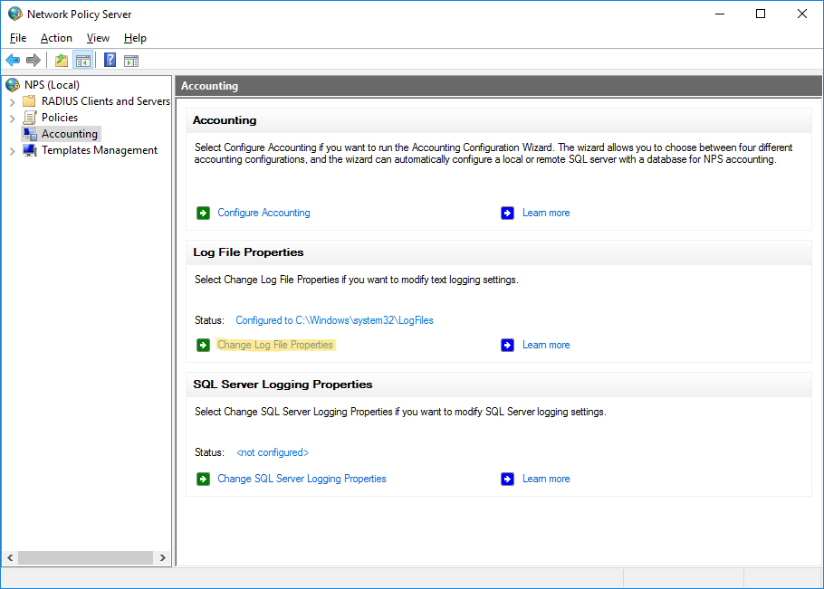
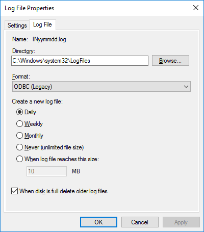
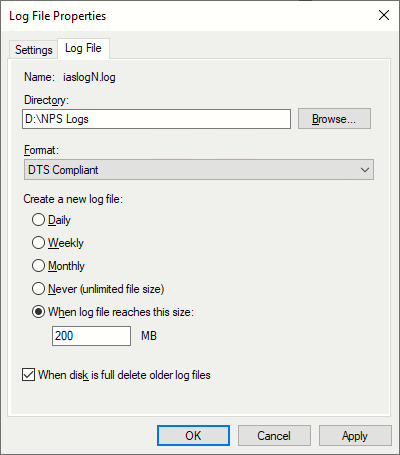

# Configuring NPS

{ style="float:right"; width="250"; data-description='Click on "Change Log File Properties"' }

- In the NPS management console, navigate to Accounting and click on "Change Log File Properties"

{ style="float:right"; width="250"; data-description="Default NPS logging configuration" }

- The default settings have a few deficiencies:
	- Logging to `C:\` drive -- logs will fill up your boot disk!
	- ODBC format -- difficult-to-read CSV format
	- Rotation interval -- daily may result in very large files if you have a lot of traffic

{ style="float:right"; width="250"; data-description="Suggested NPS logging configuration" }

- Suggested configuration:
	- Log to a different disk 
		- Logs do not fill the boot volume
		- Makes it easy to control total disk space available for logging
	- Choose "DST Compliant" format -- this is an XML format that is easy to parse in Graylog 
	- Experiment with rotation interval to keep file sizes reasonable

!!! note "Reminder"
	Don't forget to configure these settings on each NPS server

- [x] **Configure**
- [ ] **Ingest**
- [ ] **Process**
- [ ] **Aggregate**

