# Ingesting Logs

<div markdown="1" style="clear: both; padding: 5px 0; overflow: hidden">
### Create Graylog input
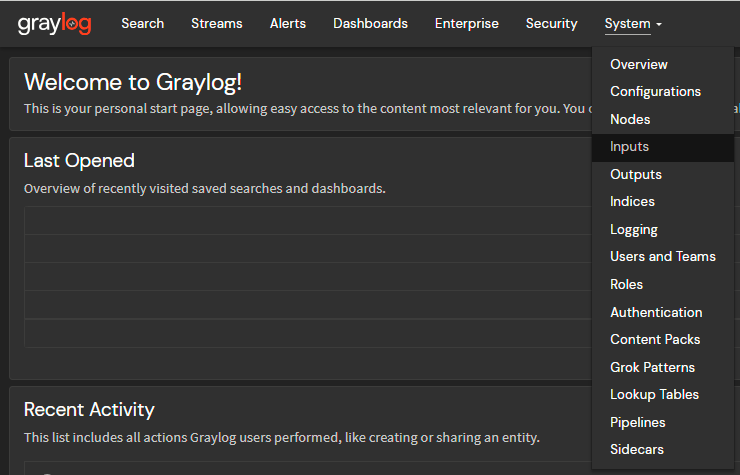{ style="float: right; clear: both; padding: 5px; width: 400px"; data-description='Navigate to System > Inputs' }

- Navigate to System > Inputs
</div>
<div markdown="1" style="clear: both; padding: 5px 0; overflow: hidden">
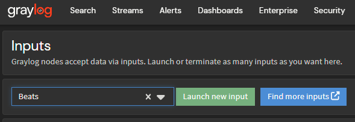{ style="float: right; clear: both; padding: 5px; width: 400px"; data-description='Launch a new "Beats" input' }

- Next to *Launch new input*, select "Beats" as the input type
- Click *Launch new input*
</div>
<div markdown="1" style="clear: both; padding: 5px 0; overflow: hidden">
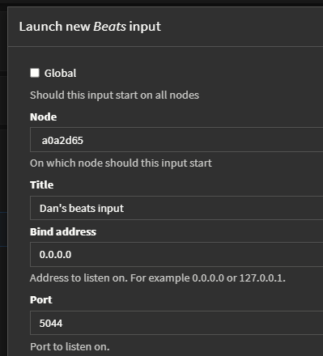{ style="float: right; clear: both; padding: 5px; width: 400px"; data-description='Enter a title and launch the new input' }

- Give the input a title and make sure that the port field is set to `5044`
- Click the *Launch* button to create the input
</div>

<div markdown="1" style="clear: both; padding: 5px 0">
### Create API Token
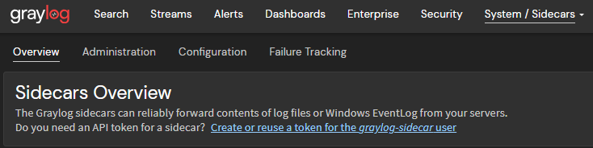{ style="float: right; clear: both; padding: 5px; width: 400px"; data-description='Click on "Create or reuse a token for the graylog-sidecar user"' }
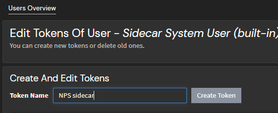{ style="float: right; clear: both; padding: 5px; width: 400px"; data-description='Enter a name and create the token' }

- Navigate to System > Sidecars
- Click on *Create or reuse a token for the graylog-sidecar user*
- Enter a name into the "Token Name" field
- Click *Create Token*
- Copy the token and store it in a safe place

!!! warning
	You will not be able to view the token again, so be sure to save it in a secure location

</div>


<div markdown="1" style="clear: both; padding: 5px 0">
### Install Sidecar on NPS Servers
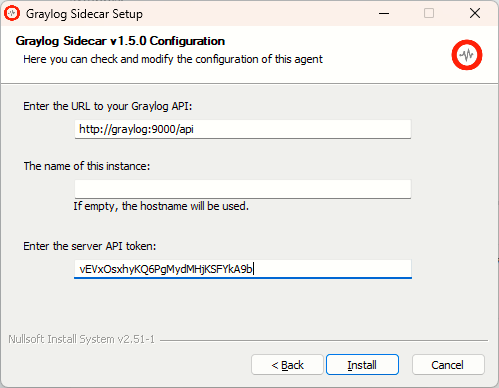{ style="float: right; clear: both; padding: 5px; width: 400px"; data-description='Enter Graylog API URL and API token during installation' }

- Download the latest Sidecar installer from <https://github.com/Graylog2/collector-sidecar/releases>{:target="_blank"}
- Run the Sidecare installer on NPS servers
- Provide the URL your Graylog server's API endpoint and API token during installation
</div>
<div markdown="1" style="clear: both; padding: 5px 0; overflow: hidden">
- After installation, configure Sidecar to run as a system service by running these commands at an elevated command prompt:
```bat
"C:\Program Files\graylog\sidecar\graylog-sidecar.exe" -service install
"C:\Program Files\graylog\sidecar\graylog-sidecar.exe" -service start
```
</div>


<div markdown="1" style="clear: both; padding: 5px 0">
### Add filebeat Collector Configuration
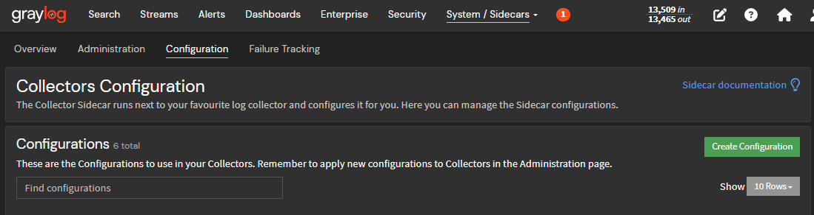{ style="float: right; clear: both; padding: 5px; width: 400px"; data-description='Enter Graylog API URL and API token during installation' }
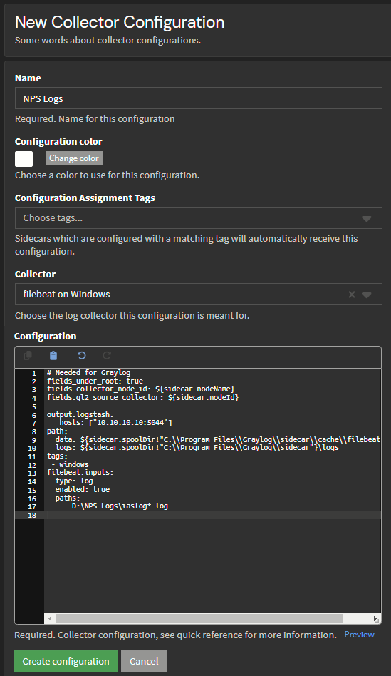{ style="float: right; clear: both; padding: 5px; width: 400px"; data-description='Enter Graylog API URL and API token during installation' }

- Navigate to System > Sidecars
- Navigate to the *Configuration* tab and click *Create Configuration*
- Enter a Name, choose the "filebeat for Windows" Collector, and input the configuration

```yaml
# Needed for Graylog
fields_under_root: true
fields.collector_node_id: ${sidecar.nodeName}
fields.gl2_source_collector: ${sidecar.nodeId}

output.logstash:
   hosts: ["10.10.10.10:5044"] # (1)!
path:
  data: ${sidecar.spoolDir!"C:\\Program Files\\Graylog\\sidecar\\cache\\filebeat"}\data
  logs: ${sidecar.spoolDir!"C:\\Program Files\\Graylog\\sidecar"}\logs
tags:
 - windows
filebeat.inputs:
- type: log
  enabled: true
  paths:
    - D:\NPS Logs\iaslog*.log # (2)!
```

1.	Put the IP address of your Graylog server here
2.	Enter the log path you configured in NPS

</div>


<div markdown="1" style="clear: both; padding: 5px 0">
### Apply Sidecar Configurations

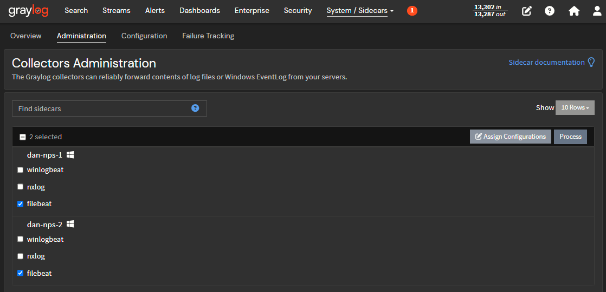{ style="float: right; clear: both; padding: 5px; width: 400px"; data-description='Select filebeat under each NPS sidecar and click "Assign Configurations"' }

- Navigate to System > Sidecars
- Click on the *Administration* tab
- If your NPS server sidecars have been successfully installed, they should be listed
- Under each NPS server sidecar, check the box next to "filebeat"
- Click *Assign Configurations*

</div>

<div markdown="1" style="clear: both; padding: 5px 0">
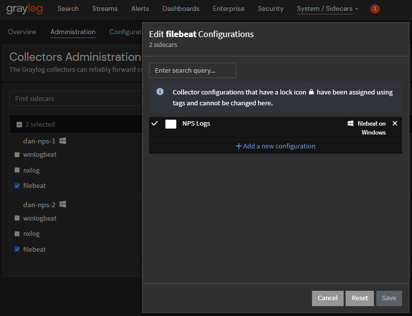{ style="float: right; clear: both; padding: 5px; width: 400px"; data-description='Assign the "NPS Logs" configuration' }

- Click to the left of "NPS Logs" to select the config and click *Save*
</div>

<div markdown="1" style="clear: both; padding: 5px 0">
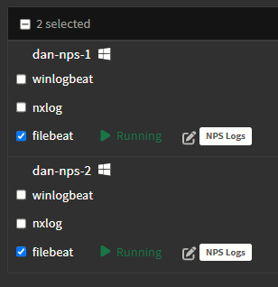{ style="float: right; clear: both; padding: 5px; width: 400px"; data-description='Sidecars running with the "NPS Logs" config applied' }

- After a few moments you should see each sidecar's status change to "Running"
</div>

<div markdown="1" style="clear: both; padding: 5px 0">
### Test
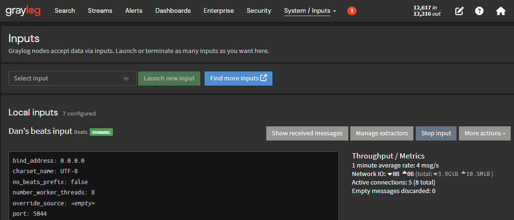{ style="float: right; clear: both; padding: 5px; width: 400px"; data-description='Click "Show received messages"' }
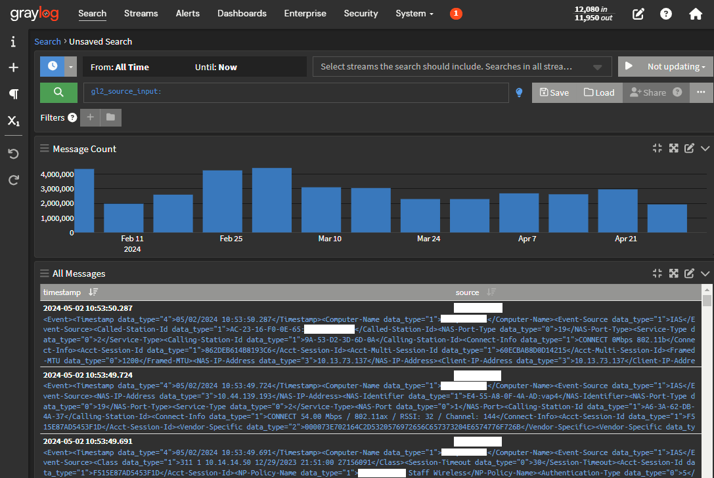{ style="float: right; clear: both; padding: 5px; width: 400px"; data-description='Log messages from our NPS log file!' }

We should be receiving log messages now. Let's check:

- Navigate to System > Inputs
- Locate the input you created earlier and click *Show received messages*
- With any luck, you should see some messages in the table

</div>

<div markdown="1" style="clear: both; padding: 5px 0">

- [x] **Configure**
- [x] **Ingest**
- [ ] **Process**
- [ ] **Aggregate**

</div>
