# Processing Logs

### Log Processing Flowchart
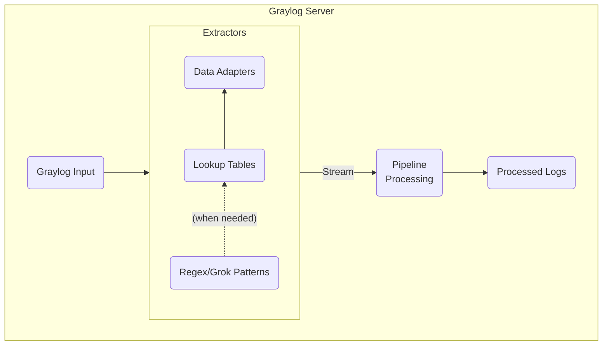

### Processing Stages

The order of message processing is configurable in System > Configurations > Message Processors.

In this example, the order of processing is:

1. Message Filter Chain (Extractors)
	- Extractors help parse log message data into useful fields
2. Stream Rule Processor
	- Messages can match multiple streams based on message source and other criteria
	- Streams route messages to index sets or forward to outputs
	- Different index sets may have different retention policies
3. Pipeline Processor
	- Pipelines consist of Stages, Rules and Functions
	- Rules define which messages should be processed by a Stage, and what Functions should be applied
	- Pipeline Functions can transform and manipulate message contents and parse message data into useful fields

I am using both extractors and pipeline rules. It would be possible, and maybe more computationally efficient, to do everything with pipeline rules, but a bit more difficult to configure (see also: *"if it ain't broke"*).

### Raw Message

```xml
<Event>
  <Timestamp data_type="4">05/02/2024 11:23:13.729</Timestamp>
  <Computer-Name data_type="1">dan-nps-1</Computer-Name>
  <Event-Source data_type="1">IAS</Event-Source>
  <Acct-Status-Type data_type="0">1</Acct-Status-Type>
  <Acct-Authentic data_type="0">1</Acct-Authentic>
  <User-Name data_type="1">john_doe@iu13.org</User-Name>
  <Called-Station-Id data_type="1">AC-23-16-F2-15-11:IU13Employee</Called-Station-Id>
  <NAS-Port-Type data_type="0">19</NAS-Port-Type>
  <Service-Type data_type="0">2</Service-Type>
  <Calling-Station-Id data_type="1">52-F6-D8-CB-01-2D</Calling-Station-Id>
  <Connect-Info data_type="1">CONNECT 0Mbps 802.11b</Connect-Info>
  <Acct-Session-Id data_type="1">26ECD9A769A00227</Acct-Session-Id>
  <Acct-Multi-Session-Id data_type="1">A64281482EF1BDCD</Acct-Multi-Session-Id>
  <Class data_type="1">311 1 10.10.10.10 12/29/2023 21:55:52 6903028</Class>
  <Event-Timestamp data_type="4">05/02/2024 15:23:13</Event-Timestamp>
  <Acct-Delay-Time data_type="0">0</Acct-Delay-Time>
  <NAS-IP-Address data_type="3">10.13.41.33</NAS-IP-Address>
  <Client-IP-Address data_type="3">10.13.41.33</Client-IP-Address>
  <Client-Vendor data_type="0">0</Client-Vendor>
  <Client-Friendly-Name data_type="1">IU13 APs</Client-Friendly-Name>
  <Proxy-Policy-Name data_type="1">Staff Wireless</Proxy-Policy-Name>
  <Packet-Type data_type="0">4</Packet-Type>
  <Reason-Code data_type="0">0</Reason-Code>
</Event>
```

!!! note
	The message is really on a single line -- here I added line breaks for readability.

Since the data is already structured, we simply need to extract the contents of each XML element to a field in Graylog.

### Enriching the Data

Some fields such as `Packet-Type` and `Reason-Code` are enumerated types that are coded as integers:

```xml
<Packet-Type data_type="0">4</Packet-Type>
<Reason-Code data_type="0">0</Reason-Code>
```

What does a `Packet-Type` of `4` indicate? We can transform these to human-readable values using lookup tables.

| Packet-Type | Description  |
| ----------: | ------------ |
| 1           | Access-Request                 |
| 2           | Access-Accept                  |
| 3           | Access-Reject                  |
| 4           | Accounting-Request             |
| 5           | Accounting-Response            |
| 11          | Access-Challenge               |
| 12          | Status-Server (experimental)   |
| 13          | Status-Client (experimental)   |
| 255         | Reserved                       |

I have created CSV files with mappings for seven enum fields. They are available at <https://github.com/bakerds/NPS-Log-Parsing>{:target=blank}


Graylog can consume these CSV files using a Data Adapter, and make them available for use as a Lookup Table.

<div markdown="1" style="clear: both; padding: 5px 0; overflow: hidden">
#### Data Adapter
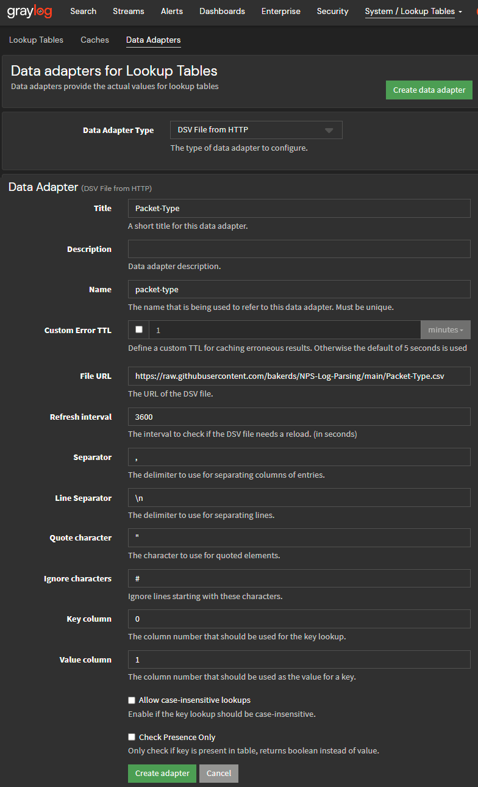{ style="float: right; clear: both; padding: 5px; width: 400px"; data-description='Create a Data Adapter for each enum field' }
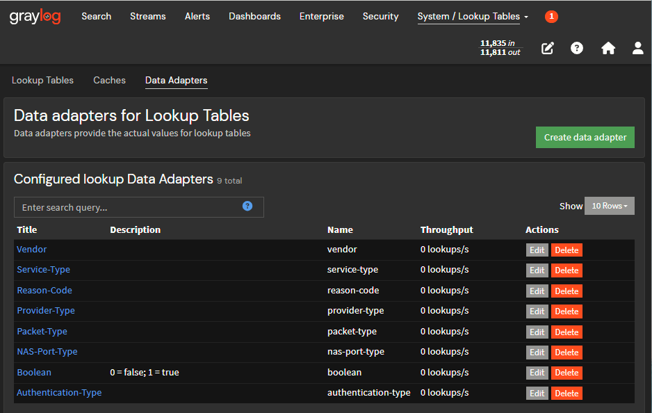{ style="float: right; clear: both; padding: 5px; width: 400px"; data-description='Completed Data Adapters' }

We need to create a Data Adapter for each field we want to translate using a lookup table.

- Navigate to System > Lookup Tables
- Click on the Data Adapters Tab
- Click *Create data adapter*
	- Choose "DSV File from HTTP" for the *Data Adapter Type*
	- Enter the field name in the *Title*
	- Enter the *File URL*
	- Set *Refresh interval* to a reasonable value -- `86400` (once a day) is sufficient
	- Set *Separator* to `,`
	- Set *Line Separator* to `\n`
	- Click *Create adapter*
- Repeat for each field you wish to translate, plus one for translating boolean values:
	- [`Authentication-Type`](https://raw.githubusercontent.com/bakerds/NPS-Log-Parsing/main/Authentication-Type.csv){:target=blank}
	- [`NAS-Port-Type`](https://raw.githubusercontent.com/bakerds/NPS-Log-Parsing/main/NAS-Port-Type.csv){:target=blank}
	- [`Packet-Type`](https://raw.githubusercontent.com/bakerds/NPS-Log-Parsing/main/Packet-Type.csv){:target=blank}
	- [`Provider-Type`](https://raw.githubusercontent.com/bakerds/NPS-Log-Parsing/main/Provider-Type.csv){:target=blank}
	- [`Reason-Code`](https://raw.githubusercontent.com/bakerds/NPS-Log-Parsing/main/Reason-Code.csv){:target=blank}
	- [`Service-Type`](https://raw.githubusercontent.com/bakerds/NPS-Log-Parsing/main/Service-Type.csv){:target=blank}
	- [`Vendor`](https://raw.githubusercontent.com/bakerds/NPS-Log-Parsing/main/Vendor.csv){:target=blank}
	- [`Boolean`](https://raw.githubusercontent.com/bakerds/NPS-Log-Parsing/main/boolean.csv){:target=blank}

</div>

<div markdown="1" style="clear: both; padding: 5px 0; overflow: hidden">
#### Cache
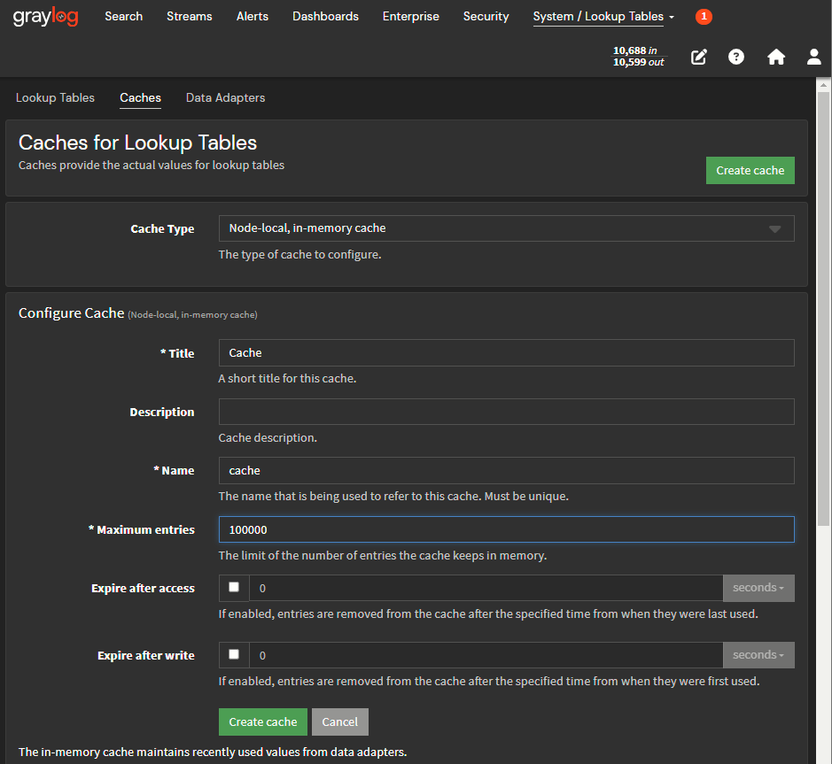{ style="float: right; clear: both; padding: 5px; width: 400px"; data-description='Create a Lookup Table Cache' }

To use a Data Adapter in a Lookup Table, we must first create a Cache. 

- Navigate to System > Lookup Tables
- Click on the Caches Tab
- Click *Create cache*
	- For *Cache Type*, choose "Node-local, in-memory cache"
	- Enter a Title
	- Set a reasonable value for *Maximum entries* -- we are dealing with a relatively small set of values, so we can afford to cache them all
	- Uncheck *Expire after access* -- again, we have relatively few entries to cache and don't need to expire them
	- Click *Create cache*

</div>

<div markdown="1" style="clear: both; padding: 5px 0; overflow: hidden">
#### Lookup Tables
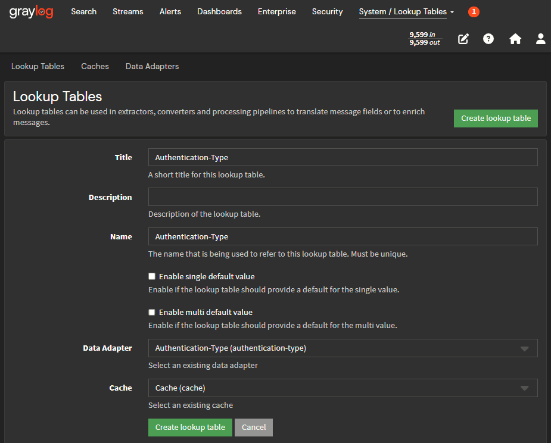{ style="float: right; clear: both; padding: 5px; width: 400px"; data-description='Create a Lookup Table for each field' }
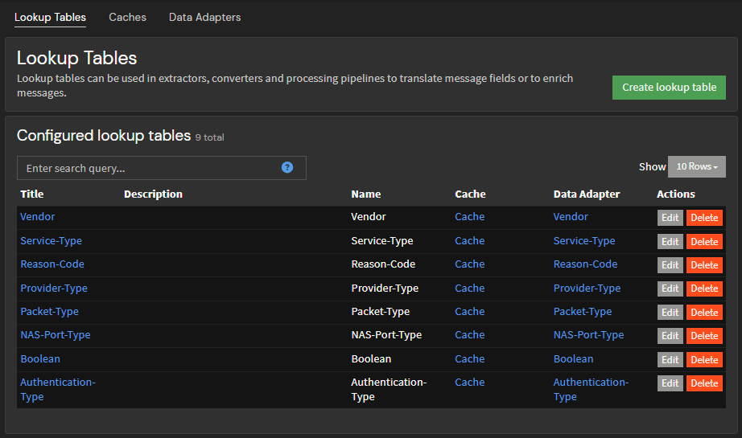{ style="float: right; clear: both; padding: 5px; width: 400px"; data-description='Completed Lookup Tables' }

- Navigate to System > Lookup Tables
- Create a Lookup Table for each field
	- Click *Create lookup table*
	- Enter the field name in *Title* and *Name*
	- Select the Data Adapter for the field
	- Select the Cache
	- Click *Create lookup table*

</div>


<div markdown="1" style="clear: both; padding: 5px 0">
### Extractors
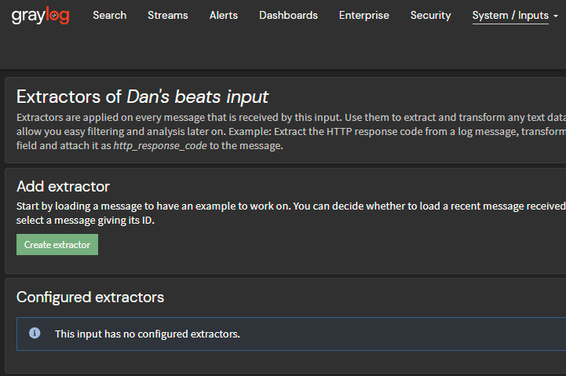{ style="float: right; clear: both; padding: 5px; width: 400px"; data-description='Click "Create extractor"' }
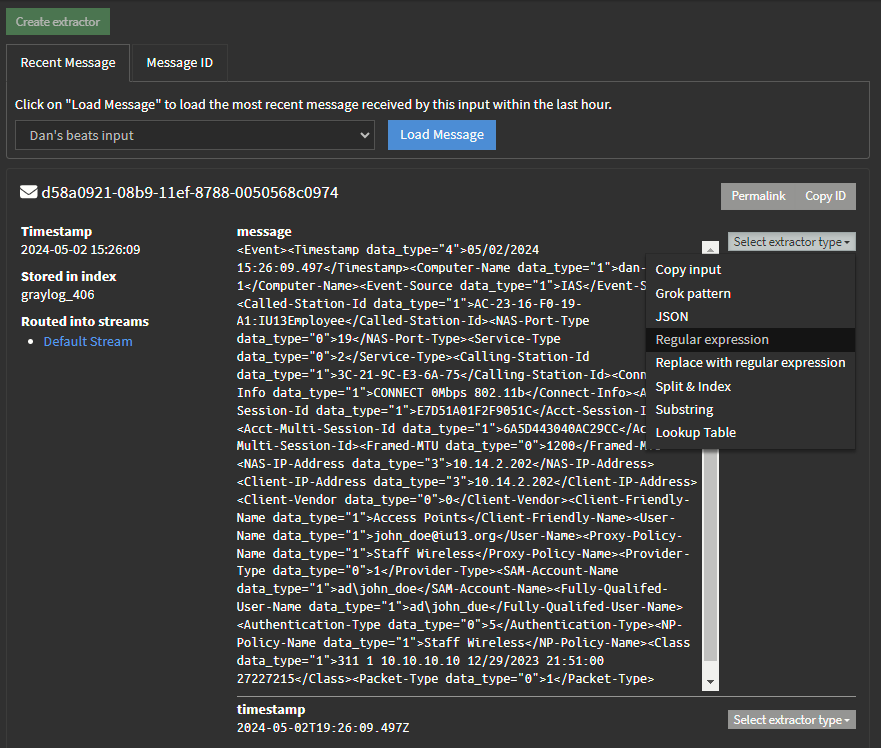{ style="float: right; clear: both; padding: 5px; width: 400px"; data-description='For the message field, Select extractor type: Regular expression' }

- Navigate to System > Inputs
- Locate the input you created earlier and click *Manage extractors*
- Click *Create extractor*
- Click *Load Message* to load a recent message from the input. This message will be used to test your new extractor
- Next to the *message* field, click *Select extractor Type*
- Choose *Regular expression*

</div>


<div markdown="1" style="clear: both; padding: 5px 0">
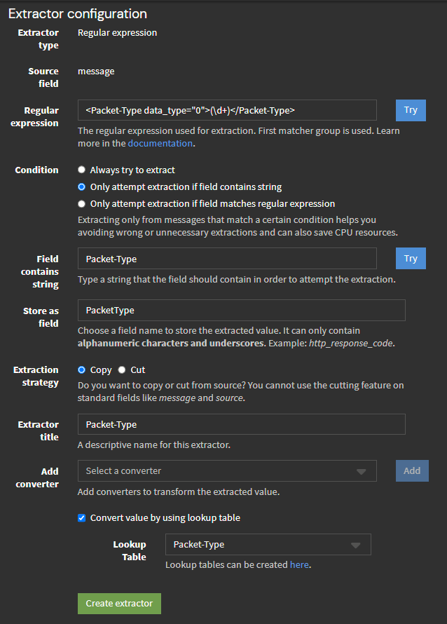{ style="float: right; clear: both; padding: 5px; width: 400px"; data-description='Configure new extractor' }

- In this example, we will extract the `Packet-Type` field value
	```xml
	<Packet-Type data_type="0">4</Packet-Type>
	```

- To extract the value `4` from this part of the message, we'll use this regular expression:
	```xml
	<Packet-Type data_type="0">(\d+)</Packet-Type>
	```
- Click the *Try* button to see if it works
- We only want the extractor to run if the Packet-Type tag is present in the message, so select *Only attempt extraction if field contains string* and enter `Packet-Type` in the *Field contains string* textbox
- Enter `PacketType` in *Store as field*

	!!! note
		The field name cannot contain a hyphen -- only alphanumeric characters and underscores are allowed

- Enter `Packet-Type` in the *Extractor title* textbox
- Next to *Add converter*, select "Lookup Table" and click the *Add* button
	- Next to *Lookup Table*, select the "Packet-Type" lookup table
- Click *Create Extractor*

</div>
<div markdown="1" style="clear: both; padding: 5px 0">
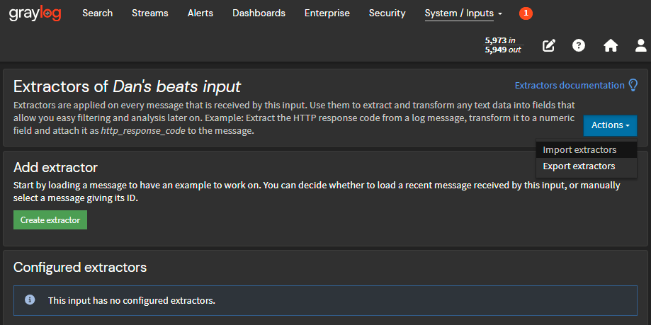{ style="float: right; clear: both; padding: 5px; width: 400px"; data-description='Click "Import extractors"' }


Most of the extractors work like this one. 

To save time, you can import the rest of the extractors that I have already created:

- Navigate to System > Inputs
- Locate the input you created earlier and click *Manage extractors*
- Click Actions > Import extractors

</div>
<div markdown="1" style="clear: both; padding: 5px 0">
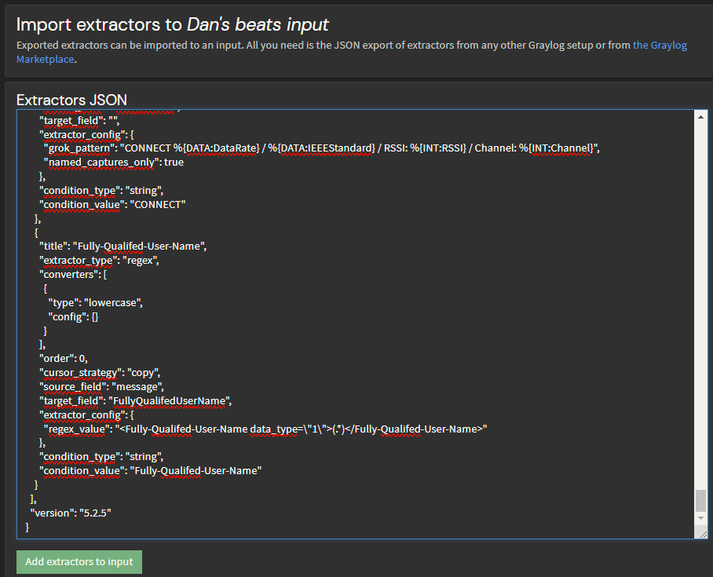{ style="float: right; clear: both; padding: 5px; width: 400px"; data-description='Paste and click "Add extractors to input"' }

- Paste the contents of [this file](https://raw.githubusercontent.com/bakerds/NPS-Log-Parsing/main/nps-extractors.json){:target=blank} in the text area and click *Add extractors to input*

</div>
<div markdown="1" style="clear: both; padding: 5px 0">
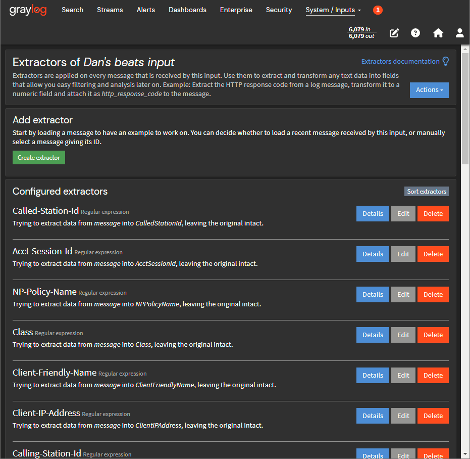{ style="float: right; clear: both; padding: 5px; width: 400px"; data-description='List of extractors' }

- Go back to the Extractors page and confirm that the extractors have been imported successfully

</div>
<div markdown="1" style="clear: both; padding: 5px 0">

!!! tip 
	For some variety, check out the Connect String Parser extractor. That one uses a Grok pattern to parse multiple fields from one XML tag value.

!!! bug 
	`Fully-Qualifed-User-Name` is misspelled -- by the NPS programmers! I have used their incorrect spelling in the extractor title and field name to keep it consistent with the source log files.

</div>

<div markdown="1" style="clear: both; padding: 5px 0">
### Pipeline Processing

One issue with our logs is timestamping. Graylog does not know how to read the timestamp within an NPS log message, so it will record the time when it *received* the message, not the time the message was generated by NPS.

We can fix that by using a pipeline rule to parse the timestamp NPS records within the log message, and replace the timestamp Graylog recorded when the message was received at the input.

NPS uses a non-standard time format that looks like this: `04/05/2023 10:08:50.910`

!!! warning  "Heads up!"
	NPS uses the server's local time and does not indicate the timezone, so we must specify a timezone when we parse the timestamp. 
	
	If you have servers in multiple timezones, you will need to handle that somehow.

</div>

<div markdown="1" style="clear: both; padding: 5px 0">
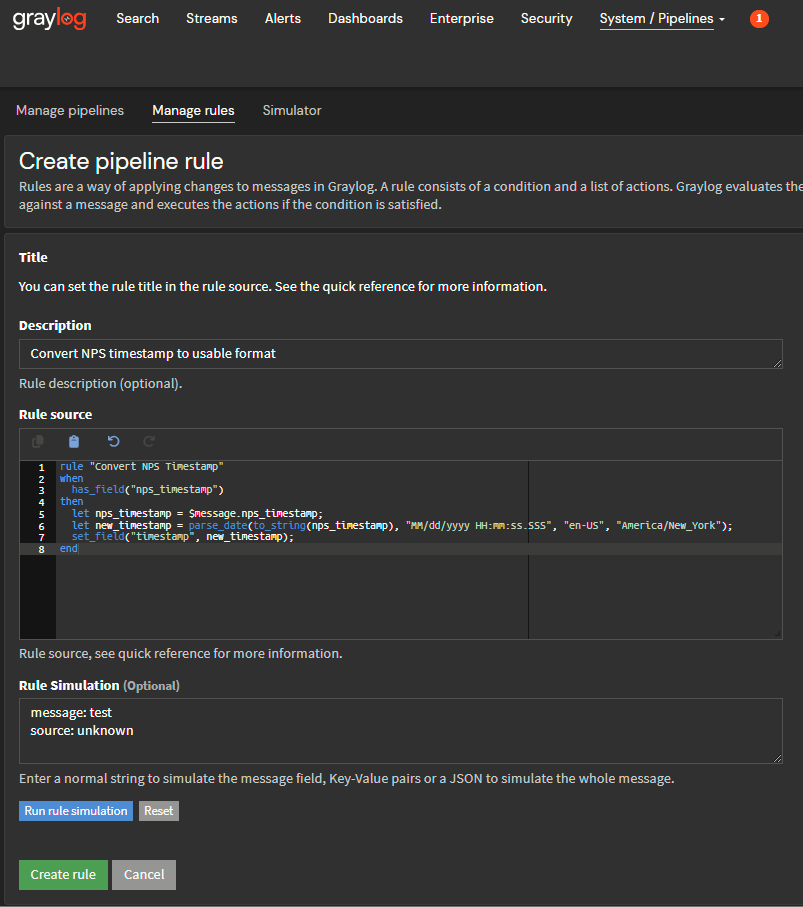{ style="float: right; clear: both; padding: 5px; width: 400px"; data-description='List of extractors' }

- Navigate to System > Pipelines and click the *Manage rules* tab
- Click *Create Rule*
- Click *Use Source Code Editor*
- Give the rule a helpful description
- In the *Rule Source* field, paste the following code
	```javascript
	rule "Convert NPS Timestamp"
	when
	  has_field("nps_timestamp")
	then
	  let nps_timestamp = $message.nps_timestamp;
	  let new_timestamp = parse_date(to_string(nps_timestamp), "MM/dd/yyyy HH:mm:ss.SSS", "en-US", "America/New_York");
	  set_field("timestamp", new_timestamp);
	end
	```
- Click *Create Rule*
</div>

<div markdown="1" style="clear: both; padding: 5px 0">
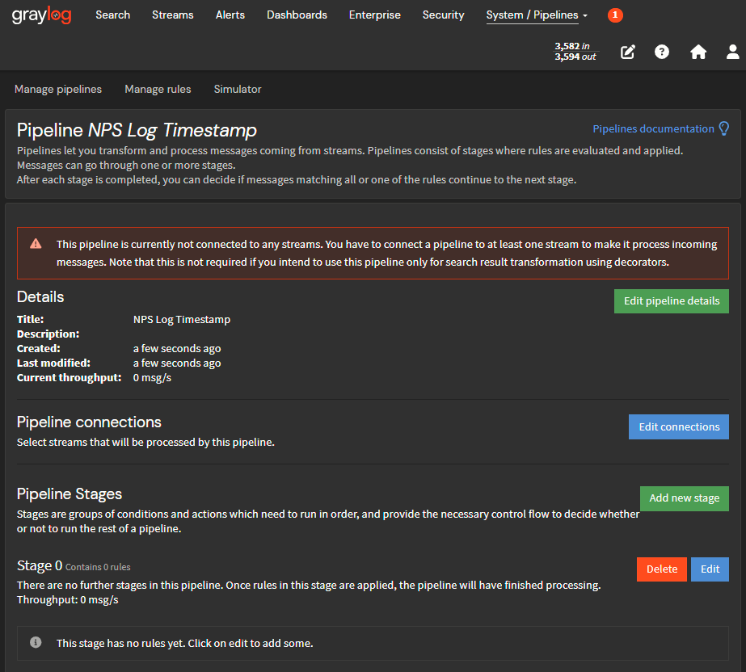{ style="float: right; clear: both; padding: 5px; width: 400px"; data-description='New pipeline' }
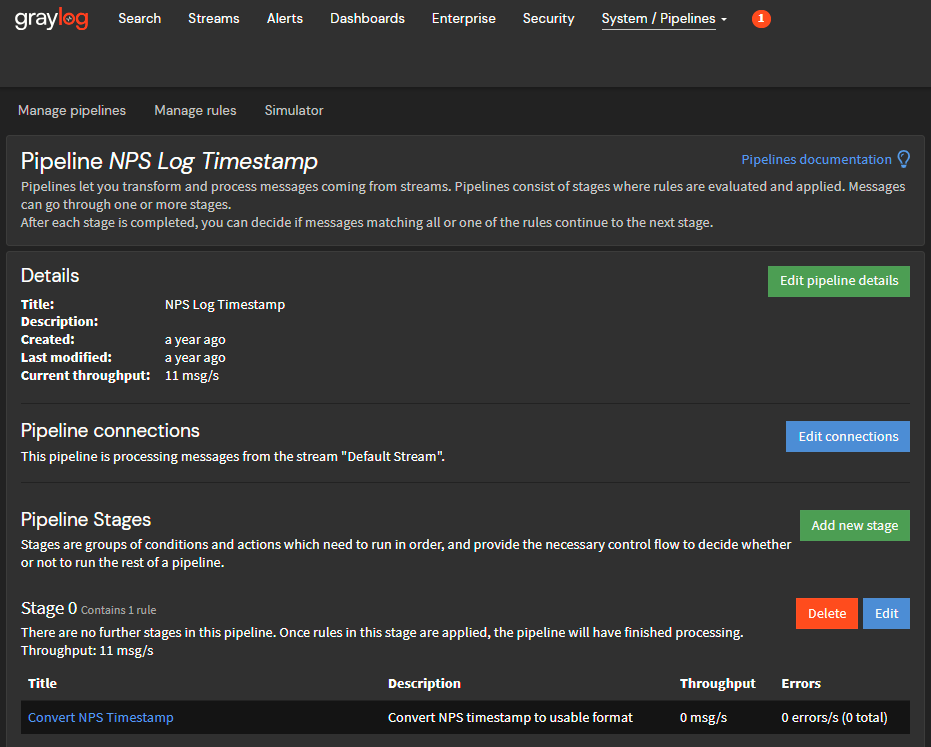{ style="float: right; clear: both; padding: 5px; width: 400px"; data-description='Completed pipeline' }


- Navigate to System > Pipelines and click *Add new pipeline*
- Give the pipeline a name and click *Create pipeline*
	- New pipelines have one stage called "Stage 0" with no rules
- Click *Edit* next to "Stage 0"
	- Under *Stage Rules*, select the "Convert NPS Timestamp" rule you just created
	- Click *Update stage*
- Back in the Pipeline details, click *Edit connections*
	- Under *Streams*, select the "Default Stream"
	- Click *Update connections*


</div>
<div markdown="1" style="clear: both; padding: 5px 0">
### Test
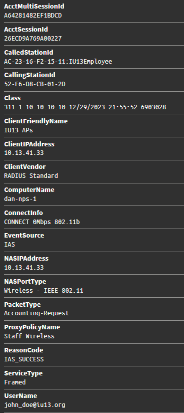{ style="float: right; clear: both; padding: 5px; width: 368px"; data-description='Parsed message' }

- Navigate to System > Inputs
- Locate the input you created earlier and click *Show received messages*
- With any luck, you should see some messages in the table -- with data parsed into useful, aggregable, and searchable fields! 🎉

</div>
<div markdown="1" style="clear: both; padding: 5px 0">

- [x] **Configure**
- [x] **Ingest**
- [X] **Process**
- [ ] **Aggregate**

</div>
