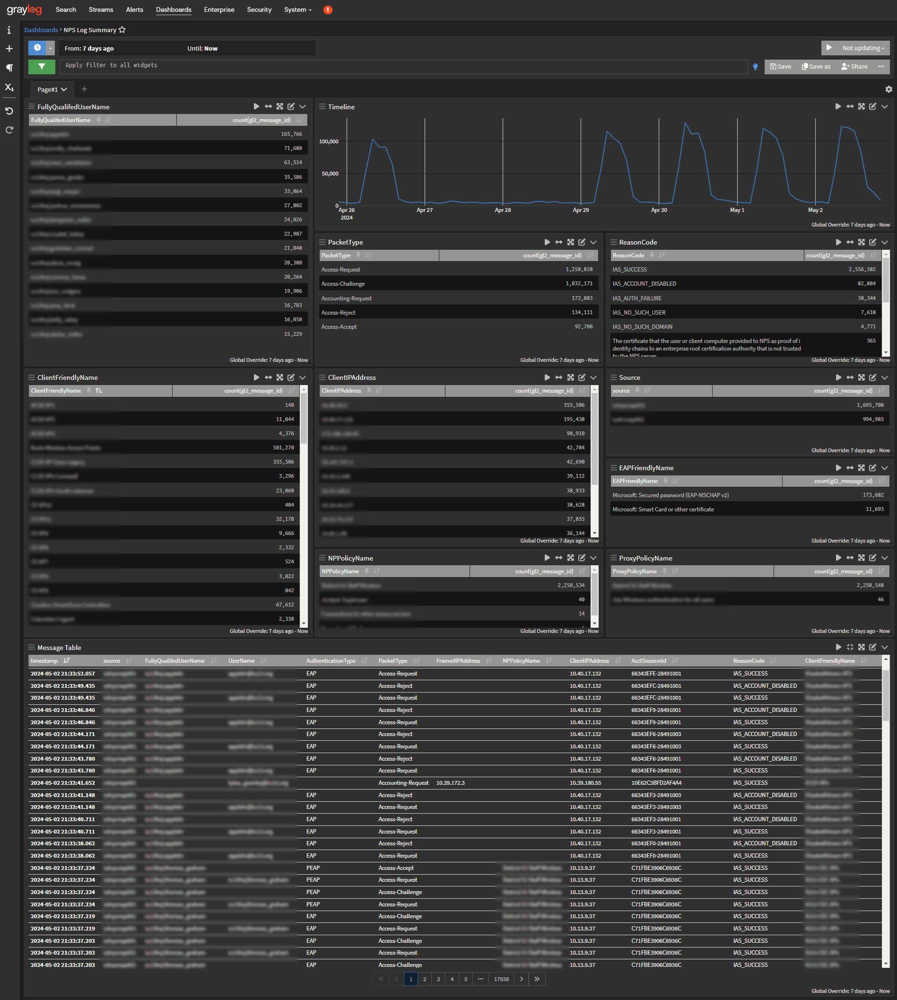
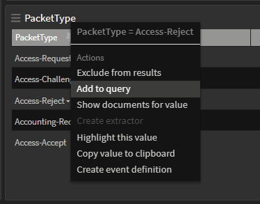
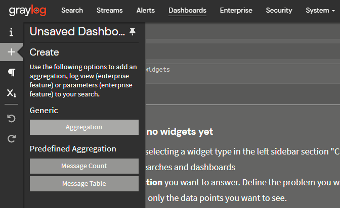
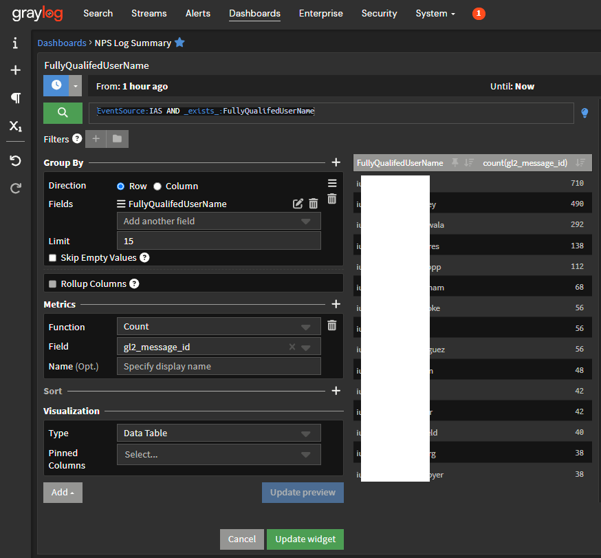

# Aggregating and Viewing Logs

### Sample Dashboard

Now that our data is parsed into useful fields, we can aggregate and summarize it. A dashboard is a set of widgets that show messages, counts, or aggregations. 

<div markdown="1" style="clear: both; padding: 5px 0">
{ style="float: right; clear: both; padding: 5px; max-width: 600px" }

Here is an example dashboard that shows: 

- the number of NPS log messages received over time
- the most frequently logged 
	- `FullyQualifedUserName`
	- `PacketType`
	- `ReasonCode`
	- `ClientFriendlyName`
	- `ClientIPAddress`
	- `Source`
	- `EAPFriendlyName`
	- `NPPolicyName`
	- `ProxyPolicyName`
- the most recently received messages matching the filter criteria

</div>

<div markdown="1" style="clear: both; padding: 5px 0">
{ style="float: right; clear: both; padding: 5px"; data-description='Easy filtering of results' }

Dashboards also provide an easy way to "drill down". By clicking on a value in an aggregation, we can exclude or include messages matching that field value.

</div>

<div markdown="1" style="clear: both; padding: 5px 0">
### Creating Dashboards
In this example, we'll aggregate the top *n* values of `FullyQualifedUserName`
</div>

<div markdown="1" style="clear: both; padding: 5px 0">

{ style="float: right; clear: both; padding: 5px; max-width: 500px"; data-description='Easy filtering of results' }

- Navigate to Dashboards and click *Create new dashboard*
- Click on the <svg style="max-width: 20px; max-height: 20px" xmlns="http://www.w3.org/2000/svg" viewBox="0 0 448 512"><path fill="currentColor" d="M256 80c0-17.7-14.3-32-32-32s-32 14.3-32 32V224H48c-17.7 0-32 14.3-32 32s14.3 32 32 32H192V432c0 17.7 14.3 32 32 32s32-14.3 32-32V288H400c17.7 0 32-14.3 32-32s-14.3-32-32-32H256V80z"></path></svg> *Create* button 
- Click on *Aggregation*
- Click the *Edit* button on the empty aggregation
</div>

<div markdown="1" style="clear: both; padding: 5px 0">
{ style="float: right; clear: both; padding: 5px; max-width: 500px"; data-description='Create aggregation widgets' }

- In the Query field, enter this query and click the <svg style="max-width: 16px; max-height: 16px" xmlns="http://www.w3.org/2000/svg" viewBox="0 0 512 512"><path fill="currentColor" d="M416 208c0 45.9-14.9 88.3-40 122.7L502.6 457.4c12.5 12.5 12.5 32.8 0 45.3s-32.8 12.5-45.3 0L330.7 376c-34.4 25.2-76.8 40-122.7 40C93.1 416 0 322.9 0 208S93.1 0 208 0S416 93.1 416 208zM208 352a144 144 0 1 0 0-288 144 144 0 1 0 0 288z"></path></svg> *Search* button

	```elixir
	EventSource:IAS AND _exists_:FullyQualifedUserName
	```
	
	This query ensures that
	
	1. we only aggregate logs from NPS (`EventSource:IAS`)
	2. we only try to aggregate messages that actually include this field (`_exists_:FullyQualifedUserName`)

- Under *Group By*, add the `FullyQualifedUserName` field

	- Set the limit to a reasonable value (`15`, for example)
	
- Under *Metrics*, choose the "Count" *Function* and select the `gl2_message_id` field

	- This causes matching messages to be counted exactly once, as `gl2_message_id` is unique for each message
	
- Click *Update preview* to test your aggregation
- If you are satisfied, click *Update widget*
- Create additional widgets for each property you wish to aggregate


</div>

!!! warning
	Be sure to save your dashboard before you navigate away from the page or close your browser!


<div markdown="1" style="clear: both; padding: 5px 0">

- [x] **Configure**
- [x] **Ingest**
- [X] **Process**
- [X] **Aggregate**

</div>
