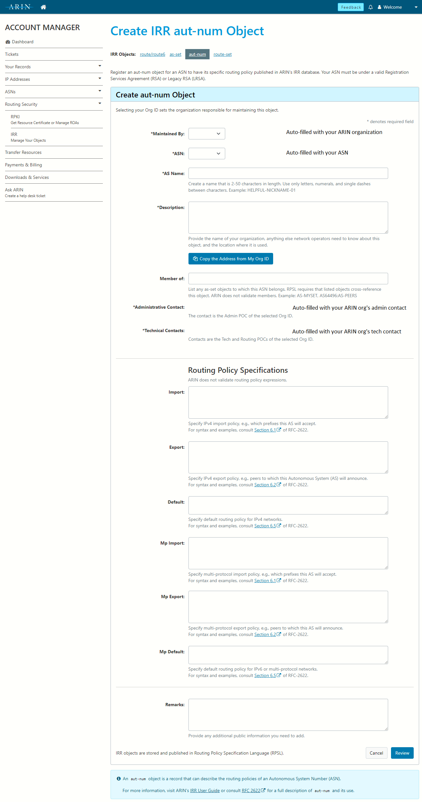

# IRR — Internet Routing Registry

The IRR is not a single database — there are several routing registries to choose from:

- ARIN (most likely choice) - rr.arin.net
- RADb (pay to list) - whois.radb.net
- Level3 - rr.level3.net
- NTT - rr.ntt.net

Most IRR databases mirror the others.

The IRR can be queried using whois: `whois -h rr.arin.net AS14773`

!!! note 
    If you don't have a whois client (Windows :unamused:), you can query from your web browser at [https://www.radb.net/query](https://www.radb.net/query?keywords=AS14773){:target="_blank"}.
	
    If you're on Ubuntu/Debian, `sudo apt install whois`


## Using the IRR

### Publishing routing information

#### Object types

- **route/route6**: describes a prefix that you will originate
    - Maintained By: links the record to your ARIN organization
    - Prefix: the prefix you plan to announce
    - Origin: the ASN that will originate the prefix
    - Description: your organization's name and address, and any additional information about the prefix
- **as-set**: specifies a set of Autonomous System Numbers (ASNs) through which traffic can be routed. Useful if you have downstream ASNs (customers)
    - AS Set Name: the unique name of the as-set
    - Description: your organization's name and address, and any additional information about the as-set
    - Members: ASNs and as-set names that are included in the as-set
- **aut-num**: specifies an ASN and its routing policies
    - Maintained By: links the record to your ARIN organization
    - ASN: the ASN described by this object
    - AS Name: a human-readable nickname for the ASN
    - Description: your organization's name and address, and any additional information about the autonomous system
    - Routing Policy Specifications:
        - Import: IPv4 import policy
        - Export: IPv4 export policy
        - Default: IPv4 default routing policy
        - Mp Import: multi-protocol import policy (multi-protocol support added later for IPv6)
        - Mp Export: multi-protocol export policy
        - Mp Default: multi-protocol default routing policy
        - Remarks: additional comments or notes visible to the public
- **route-set**: a set of IPv4 prefixes, IPv6 prefixes, and other route-sets that can be used in aut-num policy specifications
    - Route Set Name: the unique name of the route-set
    - Description: your organization's name and address, and any additional information about the route-set
    - Members: a list of IPv4 prefixes or route-sets to include
    - Mp Members: a list of IPv6 prefixes or route-sets to include
    - Members by Reference: a list of organizations whose route objects should be included in the route-set
    - Remarks: additional comments or notes visible to the public

#### Example objects

**aut-num**: IU13 WAN
```
$ whois -h rr.arin.net AS14773
aut-num:        AS14773
as-name:        LANLEB-IU13
descr:          Lancaster-Lebanon IU13 WAN Consortium
				1020 New Holland Avenue
				Lancaster PA 17601
				United States
member-of:      AS-IU13WAN
mp-export:      afi any.unicast to AS-ANY announce AS-IU13WAN
admin-c:        NETWO9356-ARIN
tech-c:         NETWO9356-ARIN
mnt-by:         MNT-LLIU1
created:        2023-02-02T18:08:17Z
last-modified:  2023-02-02T18:08:17Z
source:         ARIN
```

**aut-num**: Hempfield School District
```
$ whois -h rr.arin.net AS395182
aut-num:        AS395182
as-name:        HEMPFIELD-SD
descr:          200 Church Street
                Landisville PA 17538
                United States
admin-c:        GRAHA156-ARIN
tech-c:         FARME185-ARIN
tech-c:         GRAHA156-ARIN
tech-c:         LICHT37-ARIN
mnt-by:         MNT-HSD-37
created:        2022-03-05T12:49:41Z
last-modified:  2022-03-05T12:49:41Z
source:         ARIN
```

**as-set**: IU13 WAN
```
$ whois -h rr.arin.net AS-IU13WAN
as-set:         AS-IU13WAN
descr:          Lancaster-Lebanon IU13 WAN Consortium
                1020 New Holland Avenue
                Lancaster PA 17601
                United States
members:        AS14773,AS395182,AS394781,AS398574
admin-c:        NETWO9356-ARIN
tech-c:         NETWO9356-ARIN
mnt-by:         MNT-LLIU1
created:        2022-03-07T21:58:53Z
last-modified:  2022-06-01T15:09:59Z
source:         ARIN
```

**route/route6**: IU13
```
$ whois -h rr.arin.net 206.82.16.0/20
route:          206.82.16.0/20
origin:         AS14773
descr:          Lancaster-Lebanon IU13 WAN Consortium
                1020 New Holland Avenue
                Lancaster PA 17601
                United States
admin-c:        NETWO9356-ARIN
tech-c:         NETWO9356-ARIN
mnt-by:         MNT-LLIU1
created:        2022-03-07T22:06:29Z
last-modified:  2022-03-07T22:06:29Z
source:         ARIN

$ whois -h rr.arin.net 2620:1d5::/32
route6:         2620:1d5::/32
origin:         AS14773
descr:          Lancaster-Lebanon IU13 WAN Consortium
                1020 New Holland Avenue
                Lancaster PA 17601
                United States
admin-c:        NETWO9356-ARIN
tech-c:         NETWO9356-ARIN
mnt-by:         MNT-LLIU1
created:        2022-10-03T15:48:56Z
last-modified:  2022-10-03T15:48:56Z
source:         ARIN
```

#### Example: Checking the state of IRR

**Red Lion Area School District**

Let's find out what IP ranges they have been assigned by ARIN:
```
$ whois -h whois.arin.net "o ! >  RLASD" | grep NET
Red Lion Area School District RLASD-ISP (NET-192-133-103-0-1) 192.133.103.0 - 192.133.103.255
Red Lion Area School District RED-LION-AREA-SCHOOL-DISTRICT (NET6-2620-73-A000-1) 2620:73:A000:: - 2620:73:A000:FFFF:FFFF:FFFF:FFFF:FFFF
```
We found these prefixes:

- 192.133.103.0/24
- 2620:73:a000::/48

Let's query the IRR for 192.133.103.0/24:
```
$ whois -h rr.arin.net 192.133.103.0/24
%  No entries found for the selected source(s).
```

Nothing in ARIN... let's try RADb:
```
$ whois -h whois.radb.net 192.133.103.0/24
route:      192.133.103.0/24
descr:      Zito Networks
origin:     AS397737
mnt-by:     MAINT-AS26801
changed:    skyler.blumer@zitomedia.com 20220330
source:     RADB
```

`descr: Zito Networks` is clearly not accurate, since ARIN says the prefix is allocated to Red Lion! Notice that the maintainer is Zito as well. This is an example of "proxy registration", where a carrier creates IRR on behalf of their customer to make sure the customer's route is accepted upstream.

Red Lion has two ISPs, Zito and FirstLight. What would happen if Red Lion's contract with Zito ended and Zito chose to clean up their IRR records? FirstLight *might* still carry Red Lion's prefix, but their upstream carriers would likely begin filtering it, causing bad routing or even service disruption for the school district!

Don't worry, you don't have to check every IRR database individually!

[IRR Explorer](https://irrexplorer.nlnog.net/){:target="_blank"} queries all of the IRR databases and displays a column for each database a prefix appears in, with a link to view the underlying whois query and response.

Red Lion: <https://irrexplorer.nlnog.net/asn/AS397737>{:target="_blank"}

Here we see that Red Lion's prefix appears only in RADb, the same record we discovered above.


IU13: <https://irrexplorer.nlnog.net/asn/AS14773>{:target="_blank"}

Notice the ARIN entries maintained by IU13, and RADb entries created in the past by Comcast and Zito. As long as the `origin: AS14773` is correct, it is ok to have those duplicate records. However, if a provider has listed your prefix with a different origin ASN, you should contact the IRR database operator and request that the record be removed (after you publish your own correct IRR records!)

#### Example: Publishing IRR Records

Red Lion should create the following IRR records in the ARIN database:

**aut-num**
```
aut-num:        AS397737
as-name:        RLASD
descr:          Red Lion Area School District
                696 Delta Rd
                Red Lion PA 17356
                United States
mp-export:      afi any.unicast to AS-ANY announce AS397737
admin-c:        BEARD140-ARIN
tech-c:         BEARD140-ARIN
mnt-by:         MNT-RLASD
```

**route**
```
route:          192.133.103.0/24
origin:         AS397737
descr:          Red Lion Area School District
                696 Delta Rd
                Red Lion PA 17356
                United States
admin-c:        BEARD140-ARIN
tech-c:         BEARD140-ARIN
mnt-by:         MNT-RLASD
```

##### ARIN Dashboard

<https://account.arin.net/public/secure/dashboard>{:target="_blank"}





** Review records seen by IRR Explorer after publishing changes **

### Building route filters using IRR

For customer networks (like school districts), it is important to publish your own IRR objects. Filtering received routes using IRR is only necessary when you have customer networks or non-transit peerings. Do not try to filter routes you receive from a full transit provider!

#### bgpq3

[bgpq3](https://github.com/snar/bgpq3){:target="_blank"} is a utility used to generate router configurations (prefix-lists, extended access-lists, policy-statement terms and as-path lists) based on IRR data.

!!! note
    If you're on Ubuntu/Debian, `sudo apt install bgpq3`

bgpq3 can generate output formatted for JunOS, IOS, BIRD, generic JSON, and more. ([bgpq3 man page](https://github.com/snar/bgpq3/blob/master/README.md){:target="_blank"})

#### Examples (JunOS)
If you have customer AS395182 (Hempfield School District):

```
$ bgpq3 -Jz -4 -l Cust-Hempfield-v4 AS395182
policy-options {
replace:
  route-filter-list Cust-Hempfield-v4 {
    67.199.243.0/24 exact;
  }
}

$ bgpq3 -Jz -6 -l Cust-Hempfield-v6 AS395182
policy-options {
replace:
  route-filter-list Cust-Hempfield-v6 {
    2620:120:c000::/40 exact;
  }
}
```

If you have peer AS20940 (Akamai — as-set AS-AKAMAI):

```
$ bgpq3 -Jz -A -4 -l Peer-Akamai-v4 AS-AKAMAI
policy-options {
replace:
  route-filter-list Peer-Akamai-v4 {
    2.16.0.0/13 exact;
    2.16.0.0/22 prefix-length-range /24-/24;
    2.16.4.0/22 prefix-length-range /23-/23;

    ( 6449 lines omitted )

    221.111.224.0/26 exact;
  }
}

$ bgpq3 -Jz -A -6 -l Peer-Akamai-v6 AS-AKAMAI
policy-options {
replace:
  route-filter-list Peer-Akamai-v6 {
    2001:218:3003:100::/56 exact;
    2001:218:3003:200::/56 exact;
    2001:218:3004::/48 exact;
    
    ( 2820 lines omitted )
       
    2c0f:fd58:9::/64 exact;
  }
}
```

**Config automation is strongly recommended!**

- For networks with more than a few customers or peers, config automation should be used to keep route filters up-to-date

**Watch out for filter list size!**

- Your router will likely crash and burn if you try to use a list that's too large
- For example, AS-HURRICANE, unsummarized, has over 900,000 IPv4 route entries and over 200,000 IPv6 route entries! Few, if any, hardware routers will handle lists that large
- Route server software such as BIRD can handle large filter sets more easily and are commonly deployed in IX peering environments

!!! warning
	Do not try to filter full transit providers! Filter customers and peers only.

### Problems with IRR

- IRR data is incomplete — not every organization has published IRR
- IRR data may become outdated and inaccurate over time if not actively maintained
- Not every network uses IRR to filter routes
- There is no verification of IP or ASN ownership, so untrue records could be created in the IRR in an attempt to permit BGP hijacks rather than prevent them

### Questions about IRR?
