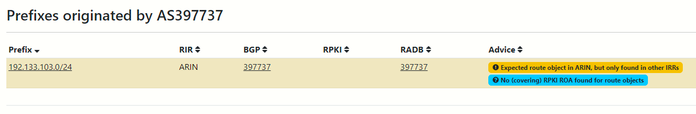
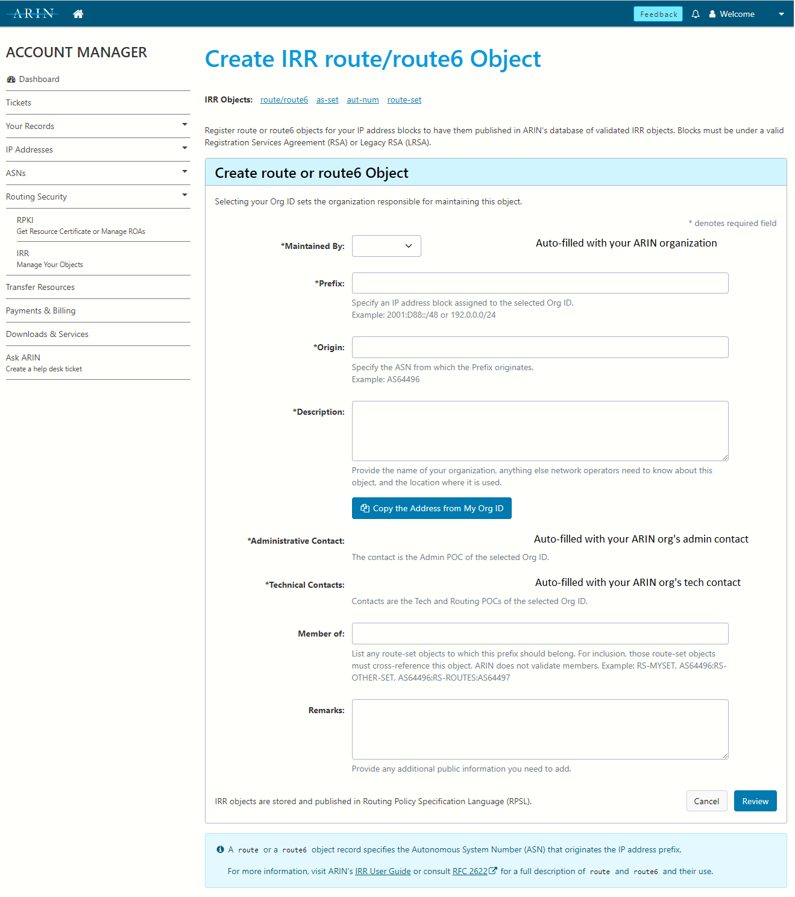
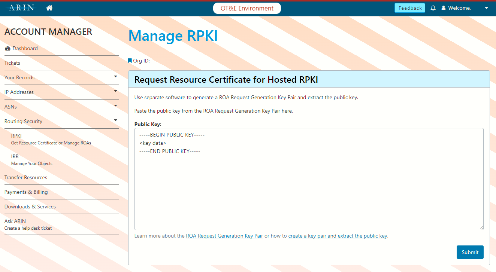
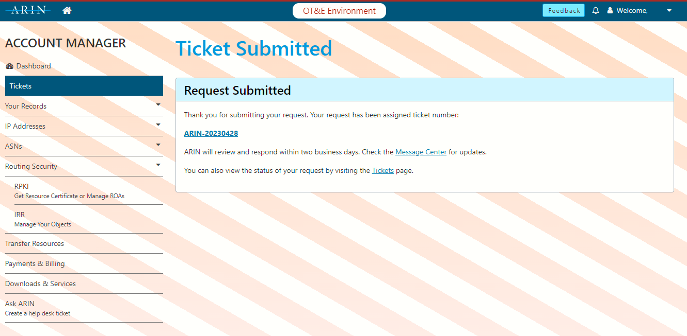
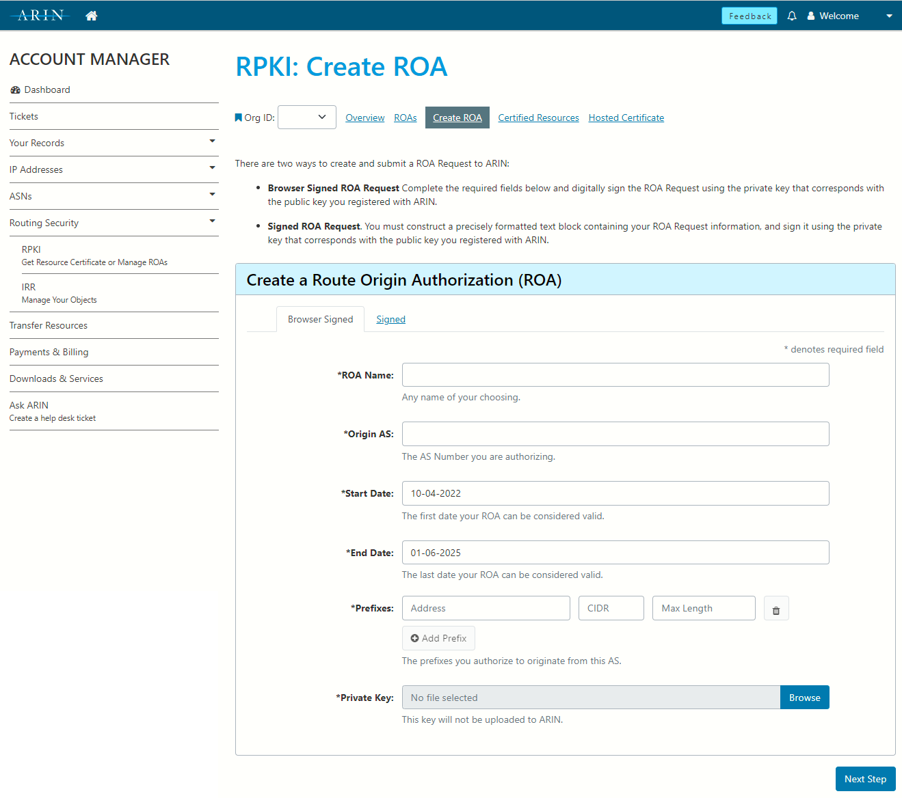

# Routing Security — BGP, IRR, and RPKI

## Important terms

- **Router**: a device that connects multiple networks at layer 3
- **Autonomous System (AS)**: a network or group of networks that belongs to a single organization and is connected to the Internet
- **Autonomous System Number (ASN)**: a 16-bit or 32-bit number that identifies an *autonomous system*
- **Border Gateway Protocol (BGP)**: the routing protocol used by Internet routers to exchange routing information between *autonomous systems*
- **Regional Internet Registry (RIR)**: an organization that manages the allocation and registration of Internet number resources such as IPv4 and IPv6 address space and AS numbers within a region of the world
- **American Registry for Internet Numbers (ARIN)**: the *regional Internet registry* for the United States, Canada, and many Caribbean and North Atlantic islands
- **Internet Routing Registry (IRR)**: a public database of routing information that can be used for matching networks to origin ASNs
- **Resource Public Key Infrastructure (RPKI)**: a cryptographic method of signing records that associate a BGP route announcement with the correct originating AS number


## Border Gateway Protocol: the routing protocol of the Internet

- BGP is the routing protocol used by all Internet service providers and many of their customers
- BGP routers may *originate* routes or prefixes for their own AS, or they may *announce* routes learned from another AS they are connected to
- An ISP router typically has the full Internet routing table in memory and knows one or more paths to every prefix announced to the Internet
- When there are multiple paths to a destination, the router uses a calculation based on BGP route attributes and locally administered policy to determine the best route


### What are IRR and RPKI for?

- IRR serves three purposes:
    - provides a means to publish your own routing intentions
    - provites the information necessary to build route filters
    - aids in troubleshooting and network management by providing information about other networks
- RPKI serves two purposes:
    - provides a cryptographic means to publish your own routing intentions
    - provides a cryptographic means for validating routes you receive


### Why are route filtering and validation important?

- The early Internet was built on trust between the connected networks. BGP has no built-in security, so **any** ASN can announce **any** prefix!
- Network operators are generally well-behaved and announce the correct routes
- Now the Internet has 5 billion users (about 70,000 active ASNs)
- Routing issues can cause financial losses, compromise of data, or even loss of life!
- Money and political gain are powerful incentives for some to tamper with Internet routing
    - Hackers and scammers
    - Unfriendly governments or adversaries
- Mistakes happen — misconfigurations or software bugs can cause route leaks, loops, and traffic loss
- Many providers use IRR to build filters. You must maintain up-to-date IRR entries to ensure all backbone carriers will carry your routes!
    - *"But I don't have IRR, and my providers are carrying my routes just fine!"*
    - Most likely one or more of your providers has created IRR records on your behalf, a practice known as "proxy registration". You should maintain your own IRR records rather than rely on a carrier to get them right. The records may have been created be a carrier you no longer use.
- Many providers filter *RPKI invalid* routes but still accept *RPKI unknown* routes. You get the most protection against route hijacking by signing your route advertisements with RPKI so they are *RPKI valid*.


# IRR — Internet Routing Registry

The IRR is not a single database — there are several routing registries to choose from:
- ARIN (most likely choice) - rr.arin.net
- RADb (pay to list) - whois.radb.net
- Level3 - rr.level3.net
- NTT - rr.ntt.net

Most IRR databases mirror the others.

The IRR can be queried using whois: `whois -h rr.arin.net AS14773`

If you don't have a whois client (Windows :unamused:), you can query from your web browser at [https://www.radb.net/query](https://www.radb.net/query?keywords=AS14773).

(If you're on Ubuntu/Debian, `sudo apt install whois`)


## Using the IRR

### Publishing routing information

#### Object types

- **route/route6**: describes a prefix that you will originate
    - Maintained By: links the record to your ARIN organization
    - Prefix: the prefix you plan to announce
    - Origin: the ASN that will originate the prefix
    - Description: your organization's name and address, and any additional information about the prefix
- **as-set**: specifies a set of Autonomous System Numbers (ASNs) through which traffic can be routed. Useful if you have downstream ASNs (customers)
    - AS Set Name: the unique name of the as-set
    - Description: your organization's name and address, and any additional information about the as-set
    - Members: ASNs and as-set names that are included in the as-set
- **aut-num**: specifies an ASN and its routing policies
    - Maintained By: links the record to your ARIN organization
    - ASN: the ASN described by this object
    - AS Name: a human-readable nickname for the ASN
    - Description: your organization's name and address, and any additional information about the autonomous system
    - Routing Policy Specifications:
        - Import: IPv4 import policy
        - Export: IPv4 export policy
        - Default: IPv4 default routing policy
        - Mp Import: multi-protocol import policy (multi-protocol support added later for IPv6)
        - Mp Export: multi-protocol export policy
        - Mp Default: multi-protocol default routing policy
        - Remarks: additional comments or notes visible to the public
- **route-set**: a set of of IPv4 prefixes, IPv6 prefixes, and other route-sets that can be used in aut-num policy specifications
    - Route Set Name: the unique name of the route-set
    - Description: your organization's name and address, and any additional information about the route-set
    - Members: a list of IPv4 prefixes or route-sets to include
    - Mp Members: a list of IPv6 prefixes or route-sets to include
    - Members by Reference: a list of organizations whose route objects should be included in the route-set
    - Remarks: additional comments or notes visible to the public

#### Example objects

##### aut-num
IU13 WAN
```
$ whois -h rr.arin.net AS14773
aut-num:        AS14773
as-name:        LANLEB-IU13
descr:          Lancaster-Lebanon IU13 WAN Consortium
                1020 New Holland Avenue
                Lancaster PA 17601
                United States
member-of:      AS-IU13WAN
mp-export:      afi any.unicast to AS-ANY announce AS-IU13WAN
admin-c:        NETWO9356-ARIN
tech-c:         NETWO9356-ARIN
mnt-by:         MNT-LLIU1
created:        2023-02-02T18:08:17Z
last-modified:  2023-02-02T18:08:17Z
source:         ARIN
```

Hempfield School District
```
$ whois -h rr.arin.net AS395182
aut-num:        AS395182
as-name:        HEMPFIELD-SD
descr:          200 Church Street
                Landisville PA 17538
                United States
admin-c:        GRAHA156-ARIN
tech-c:         FARME185-ARIN
tech-c:         GRAHA156-ARIN
tech-c:         LICHT37-ARIN
mnt-by:         MNT-HSD-37
created:        2022-03-05T12:49:41Z
last-modified:  2022-03-05T12:49:41Z
source:         ARIN
```

##### as-set
IU13 WAN
```
$ whois -h rr.arin.net AS-IU13WAN
as-set:         AS-IU13WAN
descr:          Lancaster-Lebanon IU13 WAN Consortium
                1020 New Holland Avenue
                Lancaster PA 17601
                United States
members:        AS14773,AS395182,AS394781,AS398574
admin-c:        NETWO9356-ARIN
tech-c:         NETWO9356-ARIN
mnt-by:         MNT-LLIU1
created:        2022-03-07T21:58:53Z
last-modified:  2022-06-01T15:09:59Z
source:         ARIN
```

##### route/route6
```
$ whois -h rr.arin.net 206.82.16.0/20
route:          206.82.16.0/20
origin:         AS14773
descr:          Lancaster-Lebanon IU13 WAN Consortium
                1020 New Holland Avenue
                Lancaster PA 17601
                United States
admin-c:        NETWO9356-ARIN
tech-c:         NETWO9356-ARIN
mnt-by:         MNT-LLIU1
created:        2022-03-07T22:06:29Z
last-modified:  2022-03-07T22:06:29Z
source:         ARIN

$ whois -h rr.arin.net 2620:1d5::/32
route6:         2620:1d5::/32
origin:         AS14773
descr:          Lancaster-Lebanon IU13 WAN Consortium
                1020 New Holland Avenue
                Lancaster PA 17601
                United States
admin-c:        NETWO9356-ARIN
tech-c:         NETWO9356-ARIN
mnt-by:         MNT-LLIU1
created:        2022-10-03T15:48:56Z
last-modified:  2022-10-03T15:48:56Z
source:         ARIN
```

#### Example: Checking the state of IRR

**Red Lion Area School District**

Let's find out what IP ranges they have been assigned by ARIN:
```
$ whois -h whois.arin.net "o ! >  RLASD" | grep NET
Red Lion Area School District RLASD-ISP (NET-192-133-103-0-1) 192.133.103.0 - 192.133.103.255
Red Lion Area School District RED-LION-AREA-SCHOOL-DISTRICT (NET6-2620-73-A000-1) 2620:73:A000:: - 2620:73:A000:FFFF:FFFF:FFFF:FFFF:FFFF
```
We found these prefixes:
- 192.133.103.0/24
- 2620:73:a000::/48

Let's query the IRR for 192.133.103.0/24:
```
$ whois -h rr.arin.net 192.133.103.0/24
%  No entries found for the selected source(s).
```

Nothing in ARIN... let's try RADb:
```
$ whois -h whois.radb.net 192.133.103.0/24
route:      192.133.103.0/24
descr:      Zito Networks
origin:     AS397737
mnt-by:     MAINT-AS26801
changed:    skyler.blumer@zitomedia.com 20220330
source:     RADB
```

`descr: Zito Networks` is clearly not accurate, since ARIN says the prefix is allocated to Red Lion! Notice that the maintainer is Zito as well. This is an example of "proxy registration", where a carrier creates IRR on behalf of their customer to make sure the customer's route is accepted upstream.

Red Lion has two ISPs, Zito and FirstLight. What would happen if Red Lion's contract with Zito ended and Zito chose to clean up their IRR records? FirstLight *might* still carry Red Lion's prefix, but their upstream carriers would likely begin filtering it, causing bad routing or even service disruption for the school district!

Don't worry, you don't have to check every IRR database individually!

[IRR Explorer](https://irrexplorer.nlnog.net/) queries all of the IRR databases and displays a column for each database a prefix appears in, with a link to view the underlying whois query and response.

Red Lion: https://irrexplorer.nlnog.net/asn/AS397737

Here we see that Red Lion's prefix appears only in RADb, the same record we discovered above.




IU13: https://irrexplorer.nlnog.net/asn/AS14773

Notice the ARIN entries maintained by IU13, and RADb entries created in the past by Comcast and Zito. As long as the `origin: AS14773` is correct, it is ok to have those duplicate records. However, if a provider has listed your prefix with a different origin ASN, you should contact the IRR database operator and request that the record be removed (after you publish your own correct IRR records!)

#### Example: Publishing IRR Records

Red Lion should create the following IRR records in the ARIN Dashboard:

**aut-num**
```
aut-num:        AS397737
as-name:        RLASD
descr:          Red Lion Area School District
                696 Delta Rd
                Red Lion PA 17356
                United States
mp-export:      afi any.unicast to AS-ANY announce AS397737
admin-c:        BEARD140-ARIN
tech-c:         BEARD140-ARIN
mnt-by:         MNT-RLASD
```

**route**
```
route:          206.82.16.0/20
origin:         AS397737
descr:          Red Lion Area School District
                696 Delta Rd
                Red Lion PA 17356
                United States
admin-c:        BEARD140-ARIN
tech-c:         BEARD140-ARIN
mnt-by:         MNT-RLASD
```

ARIN Dashboard Preview

https://account.arin.net/public/secure/dashboard




### Building route filters using IRR

For customer networks (like school districts), it is important to publish your own IRR objects. Filtering received routes using IRR is only necessary when you have customer networks or non-transit peerings. Do not try to filter routes you receive from a full transit provider!

#### bgpq3

[bgpq3](https://github.com/snar/bgpq3) is a utility used to generate router configurations (prefix-lists, extended access-lists, policy-statement terms and as-path lists) based on IRR data.

(If you're on Ubuntu/Debian, `sudo apt install bgpq3`)

bgpq3 can generate output formatted for JunOS, IOS, BIRD, generic JSON, and more. ([bgpq3 man page](https://github.com/snar/bgpq3/blob/master/README.md))

#### Examples (JunOS)
If you have customer AS395182 (Hempfield School District):

```
$ bgpq3 -Jz -4 -l Cust-Hempfield-v4 AS395182
policy-options {
replace:
  route-filter-list Cust-Hempfield-v4 {
    67.199.243.0/24 exact;
  }
}

$ bgpq3 -Jz -6 -l Cust-Hempfield-v4 AS395182
policy-options {
replace:
  route-filter-list Cust-Hempfield-v4 {
    2620:120:c000::/40 exact;
  }
}
```

If you have peer AS20940 (Akamai — as-set AS-AKAMAI):

```
$ bgpq3 -Jz -A -4 -l Peer-Akamai-v4 AS-AKAMAI
policy-options {
replace:
  route-filter-list Peer-Akamai-v4 {
    2.16.0.0/13 exact;
    2.16.0.0/22 prefix-length-range /24-/24;
    2.16.4.0/22 prefix-length-range /23-/23;

    ( 6449 lines omitted )

    221.111.224.0/26 exact;
  }
}

$ bgpq3 -Jz -A -6 -l Peer-Akamai-v6 AS-AKAMAI
policy-options {
replace:
  route-filter-list Peer-Akamai-v6 {
    2001:218:3003:100::/56 exact;
    2001:218:3003:200::/56 exact;
    2001:218:3004::/48 exact;
    
    ( 2820 lines omitted )
       
    2c0f:fd58:9::/64 exact;
  }
}

```

- **Config automation is strongly recommended!**
    - For networks with more than a few customers or peers, config automation should be used to keep route filters up-to-date
- **Watch out for filter list size!**
    - Your router will likely crash and burn if you try to use a list that's too large
    - For example, AS-HURRICANE, unsummarized, has over 900,000 IPv4 route entries and over 200,000 IPv6 route entries! Few, if any, hardware routers will handle lists that large
	- Route server software such as BIRD can handle large filter sets more easily and are commonly deployed in IX peering environments
	- Again, do not try to filter full transit providers! Filter customers and peers only.

### Problems with IRR
- IRR data is incomplete — not every organization has published IRR
- IRR data may become outdated and inaccurate over time if not actively maintained
- Not every network uses IRR to filter routes
- There is no verification of IP or ASN ownership, so untrue records could be created in the IRR in an attempt to permit BGP hijacks rather than prevent them

### Questions about IRR?

---

# RPKI — Resource Public Key Infrastructure

- RPKI uses cryptographically verifiable statements to ensure that Internet number resources are certifiably linked to the stated holders of those resources
- Each Regional Internet Registry (RIR) is responsible for providing resource certificates to resource holders (customer organizations)
- The resource certificate verifies the IP resources allocated to the organization
- Resource certificates are available only to organizations who have contractual relationships with one or more RIRs and have been allocated number resources (IP addresses)

**RPKI Terminology**
- **Resource Certificate**: A certificate issued by an RIR that lists a the Internet number resources (IPv4 addresses, IPv6 addresses, and Autonomous System Numbers) that are associated with an organization
- **Route Origin Authorization (ROA)**: A cryptographically signed object that states which Autonomous System (AS) is authorized to originate a particular IP address prefix or set of prefixes
    - ROA Name: a descriptive name for the ROA
	- Origin AS: the ASN that will originate the prefix
	- Start Date: the first date your ROA can be considered valid
	- End Date: the last date your ROA can be considered valid
	- Prefixes: a list of prefixes to be included in the ROA
- **Route Origin Validation**: Comparing route announcements to ROAs to determine whether a route announcement is valid
	- Valid: a ROA exists for the prefix, and the orgin AS of the route announcement matches the origin AS specified in the ROA (the announcement should be accepted)
	- Invalid: a ROA exists for the prefix, but the origin AS of the announcement *does not* match the origin AS specified in the ROA (the announcement should be rejected)
	- Not Found: no ROA exists for the prefix in the announcement (the announcement is usually accepted)

## Viewing RPKI records
RPKI records are hosted in public repositories. The easiest way to query them is using a web service such as the [Cloudflare RPKI Portal](https://rpki.cloudflare.com/) or the [RIPE Routinator](https://rpki-validator.ripe.net/ui/)

**Example ROAs**

[206.82.16.0/20](https://rpki.cloudflare.com/?view=explorer&prefix=206.82.16.0%2F20&explorerTab=list)


A ROA exists for 206.82.16.0/20 to be announced by AS14773. The ROA is signed by the ARIN Trust Anchor because the IP prefix was assigned by ARIN.

## RPKI Models
- Hosted RPKI — Recommended
    - Each RIR hosts a Certificate Authority (CA) and signs Route Origin Authorizations (ROAs) for resources within the RIR region
	- Downstream organizations must have their upstream provider submit ROAs on their behalf
	- Infrastructure is maintained by the RIR
- Delegated RPKI
    - You can run your own RPKI Certification Authority (CA), manage your Route Origin Authorizations (ROAs) and publish them in your own repository
	- You can delegate subordinate CAs to downstream organization
	- Infrastructure is maintained by the organization

ROAs cannot be created by third parties! (unlike IRR proxy registration)

## Using the RPKI

### Publishing routing information (ARIN Hosted RPKI)
Official documentation: https://www.arin.net/resources/manage/rpki/hosted/

You can preview this process using the ARIN Operational Test and Evaluation environment (OT&E) before making changes to production! Log in at https://www.ote.arin.net

#### Request a resource certificate
- Create an RSA keypair to use to sign ROAs (store private key in a secure location!)
    - `OpenSSL> genrsa -out orgkeypair.pem 2048`
- Extract public key
    - `OpenSSL> rsa -in orgkeypair.pem -pubout -outform PEM -out org_pubkey.pem`
- Request a resource certificate from ARIN
	- Log in to ARIN Online and navigate to Routing Security > RPKI
	- Click "Sign up for RPKI" for your organization
	
	- Choose "Configure Hosted"
	
	- Paste your public key that you created into the Public Key field
	
	- Submit the form and wait for ARIN to email you saying they have issue the resource certificate
	
		- If you are working in the test environment (OT&E), you should open a ticket in the production environment referencing your OT&E ticket number, as OT&E tickets are not monitored regularly.
#### Create ROAs
- Create a ROA for each prefix you advertise in BGP
	- Do not create ROAs for prefixes you do not plan to advertise!
		- This creates an opportunity for a BGP hijack
	- Do not use the max-length field to permit more-specific advertisements!
		- This creates an opportunity for a BGP hijack
	- Do not include multiple prefixes in a single ROA
		- It is not possible to remove a prefix from an existing ROA
		- If you need to remove a prefix from a ROA with multiple prefixes, you would need to delete the entire ROA and recreate it
		- Best practice is to create your ROAs with exactly one prefix each
	- When creating a ROA in ARIN, you need to provide your private key
		- The private key is used client-side to sign the ROA, which is then submitted to ARIN
		- The private key is **not** submitted to ARIN, and should *never be shared or uploaded* anywhere
		- If you lose your private key, you will need to submit a ticket to ARIN to have your RPKI records deleted and start over with a new resource certificate
	- Enter the required information, attach your private key, and click Next Step
	
	
	- The web page will generate the ROA signed by your private key and then provide a validation screen where you can confirm or cancel ROA creation

- Monitor ROAs and resource certificate for expiration
	- ARIN does not currently have a means to automatically renew expiring ROAs, but will likely release one in the future

### Validating received routes
RPKI validation is appropriate on BGP sessions where you **do not accept a default route**. It should be used with customers, non-transit peerings, and full transit providers supplying the full DFZ routing table. If you accept a default route from any neighbor, RPKI validation serves no purpose.

#### Feeding RPKI data to routers

**Relying Party**
RPKI data lives in various repositories — one for each of the RIR Trust Anchors. The repositories and delegated sub-repositories (for organizations that choose to self-host delegated RPKI) must be fetched by a Relying Party software. When all of the data has been retrieved, the Relying Party software parses it into a list of ROAs.

**RPKI-to-Router (RTR) Protocol**
Once the data has been processed by a Relying Party, then it can be sent to a router using the RPKI-to-Router (RTR) protocol, standardized in RFC 6810 and RFC 8210. Once the router is receiving RPKI data, you can apply policy actions based on validation state.

#### Relying Party
Cloudflare has released a Relying Party software called [OctoRPKI](https://github.com/cloudflare/cfrpki). OctoRPKI powers the [Cloudflare RPKI Portal](https://rpki.cloudflare.com/) and generates a json file of all ROAs, hosted in Cloudflare's CDN (https://rpki.cloudflare.com/rpki.json — warning: may crash your browser if you try to view it).

Other Relying Party software options include [Routinator](https://github.com/NLnetLabs/routinator/) and [FORT Validator](https://github.com/NICMx/FORT-validator/). Both include an RPKI-to-Router (RTR) server.

#### RTR Server
Cloudflare has released an RTR server written in Go called [GoRTR](https://github.com/cloudflare/gortr). GoRTR consumes a json file of ROAs produced by OctoRPKI or a compatible validator. By default, it uses the rpki.json hosted by Cloudflare as its input.

Cloudflare also provides a public RTR server at rtr.rpki.cloudflare.com:8282, however it is not well documented and should not be your only RTR server, should you choose to use it at all.

IU13 maintains two GoRTR servers which are used by our Internet routers and are available for WAN members use.

#### Router Configuration
Juniper, Cisco, Arista, BIRD, and several other types of routers have native support for the RTR protocol.

Configuring and verifying RTR functionality
```
routing-options {
    validation {
        group RPKI {
            max-sessions 4;
            /* rtr.rpki.cloudflare.com */
            session 172.65.0.2 {
                preference 80;
                port 8282;
            }
            session 2606:4700:60::2 {
                preference 90;
                port 8282;
            }
            /* IU13 WAN GoRTR servers */
            session 2620:1d5:xyz::123 {
                port 8282;
            }
            session 2620:1d5:xyz::abc {
                port 8282;
            }
        }
    }
}
```
```
set routing-options validation group RPKI max-sessions 4
set routing-options validation group RPKI session 172.65.0.2 preference 80
set routing-options validation group RPKI session 172.65.0.2 port 8282
set routing-options validation group RPKI session 2606:4700:60::2 preference 90
set routing-options validation group RPKI session 2606:4700:60::2 port 8282
set routing-options validation group RPKI session 2620:1d5:xyz::123 port 8282
set routing-options validation group RPKI session 2620:1d5:xyz::abc port 8282
```
```
JunOS> show validation session
Session                 State   Flaps       Uptime   #IPv4/IPv6 records
172.65.0.2              Up          0  2d 00:06:23   349613/74477
2606:4700:60::2         Up          1  1d 08:48:00   349615/74476
2620:1d5:xyz::123       Up          0  1d 23:29:27   349613/74477
2620:1d5:xyz::abc       Up          0  1d 23:28:51   349615/74476
```
```
JunOS> show validation database
RV database for instance master

Prefix          Origin-AS Session                State   Mismatch
1.0.0.0/24-24       13335 172.65.0.2             valid
1.0.0.0/24-24       13335 2606:4700:60::2        valid
1.0.0.0/24-24       13335 2620:1d5:xyz::123      valid
1.0.0.0/24-24       13335 2620:1d5:xyz::abc      valid
1.0.4.0/22-22       38803 172.65.0.2             valid
1.0.4.0/22-22       38803 2606:4700:60::2        valid
1.0.4.0/22-22       38803 2620:1d5:xyz::123      valid
1.0.4.0/22-22       38803 2620:1d5:xyz::abc      valid
...
```

Using RPKI validation in route policy
```
term RPKI-Valid {
    from {
        protocol bgp;
        validation-database valid;
    }
    then {
        validation-state valid;
        next term;
    }
}
term RPKI-Invalid {
    from {
        protocol bgp;
        validation-database invalid;
    }
    then {
        validation-state invalid;
        reject;
    }
}
```
```
set policy-options policy-statement Import-from-Transit term RPKI-Valid from protocol bgp
set policy-options policy-statement Import-from-Transit term RPKI-Valid from validation-database valid
set policy-options policy-statement Import-from-Transit term RPKI-Valid then validation-state valid
set policy-options policy-statement Import-from-Transit term RPKI-Valid then next term

set policy-options policy-statement Import-from-Transit term RPKI-Invalid from protocol bgp
set policy-options policy-statement Import-from-Transit term RPKI-Invalid from validation-database invalid
set policy-options policy-statement Import-from-Transit term RPKI-Invalid then validation-state invalid
set policy-options policy-statement Import-from-Transit term RPKI-Invalid then reject
```